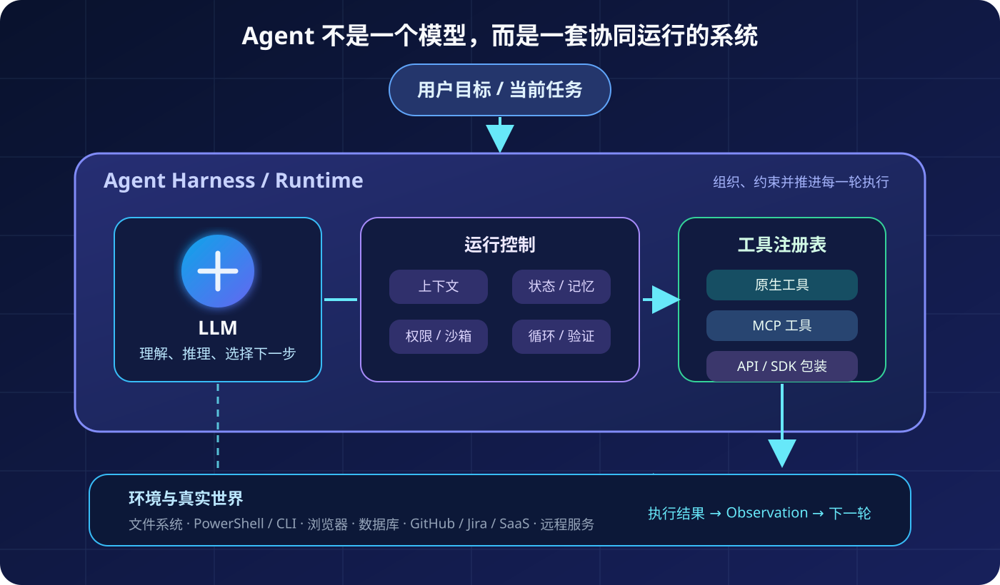
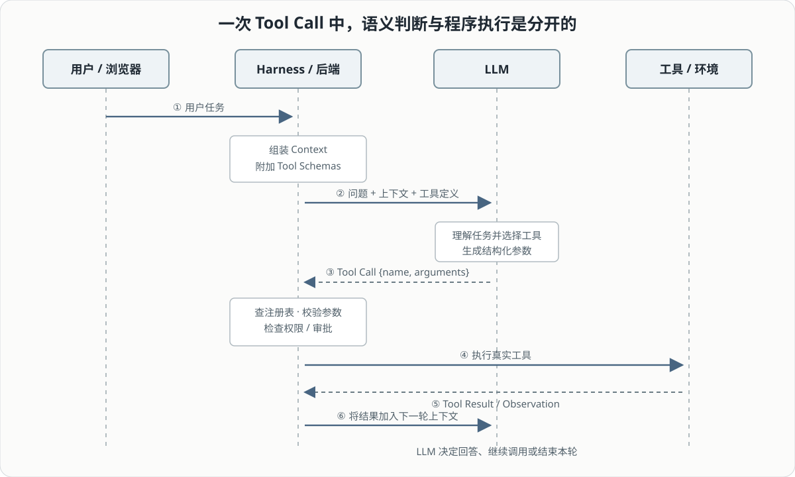
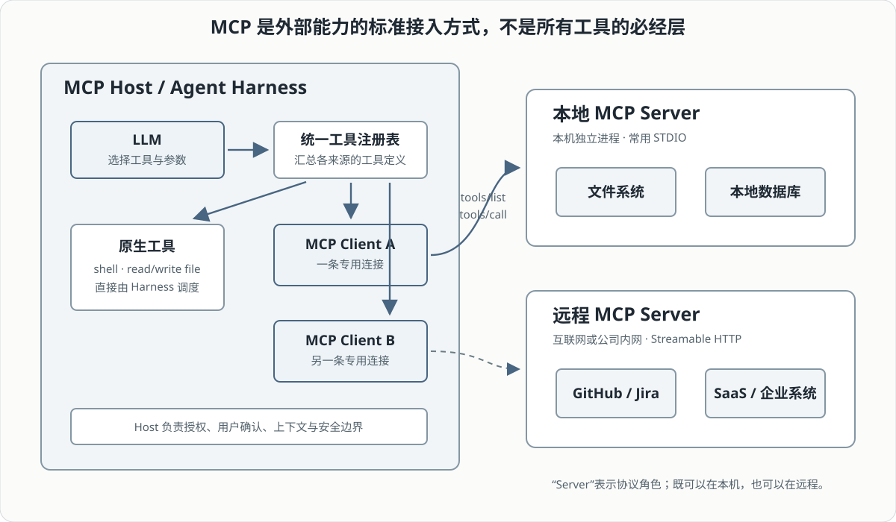
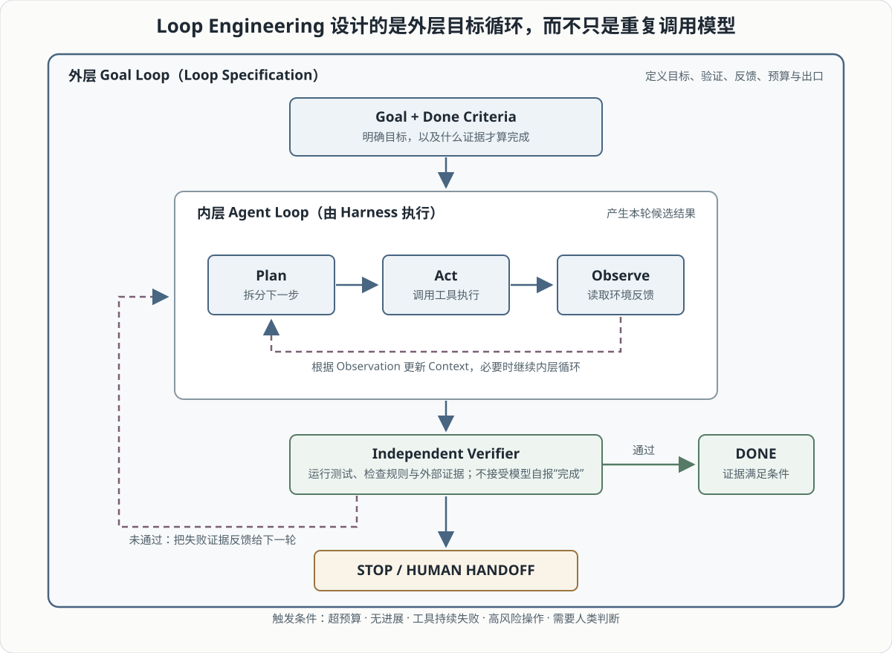

阅读《[深入理解 AI Agent：设计原理与工程实践](https://github.com/bojieli/ai-agent-book)》时，我最初把 Agent 想得过于简单：模型足够强，再给它一些工具，它就能自动完成任务。但继续追问下去会发现，真正的 Agent 不是某个模型，而是一套持续运行的系统。

这套系统里，LLM 负责理解和判断，Harness 负责组织与控制，工具负责读取或改变外部环境；当一次任务要跨越很多轮执行时，还需要一个更外层的循环来推进、验证并决定何时停止。本文沿着这条执行链路展开：

```text
用户目标
  → Harness 组织上下文与工具
  → LLM 选择行动
  → 工具改变环境
  → 环境返回结果
  → 系统判断继续还是停止
```

理解这条主线后，MCP Server 在哪里、网页端模型怎样调用工具、Codex 执行 PowerShell 是否需要 MCP，以及 Loop Engineering 究竟在“工程”什么，就都能放回正确的位置。

## 一、先把 Agent 拆开：模型只负责其中一部分

Agent 最容易造成误解的地方，是它在产品界面中看起来像一个统一角色。用户只看到一个输入框和一段回复，很自然地会把所有能力都归到模型身上。实际上，一个典型 Agent 至少由四部分组成：

- **LLM**：理解任务、推理并选择下一步行动；
- **Context / State**：保存当前任务、历史结果和必要资料；
- **Tools**：读取文件、搜索网页、执行命令或调用业务系统；
- **Harness / Runtime**：把前三者组织起来，管理权限、执行、错误和循环。



我最先产生的疑问是：**给 Agent 设计的工具，是不是都预先封装在 Harness 里面？**

“由 Harness 提供给模型”是对的，“所有实现代码都写在 Harness 内部”则不准确。Harness 通常维护一份**工具注册表**，其中记录工具名称、用途说明、输入结构、执行入口和权限规则。至于真正的实现，可以来自三个地方：

| 工具来源 | 实现位置 | 典型例子 |
| --- | --- | --- |
| 原生工具 | Harness 自身或配套运行时 | 读写文件、执行 shell、应用补丁 |
| MCP 工具 | 本地或远程 MCP Server | GitHub、Jira、数据库、知识库 |
| API / SDK 工具 | 自定义函数或后端服务 | 天气 API、订单系统、搜索接口 |

可以把注册表想成普通程序里的函数映射：

```python
tools = {
    "read_file": read_file,
    "shell": run_shell,
    "search_web": web_search_adapter,
}
```

因此 Harness 的核心价值不是亲自实现所有能力，而是把来源不同的能力转换成模型能理解、系统能控制的统一形式。它决定了模型这一轮能看到什么、能做什么，以及哪些动作需要确认。

这也解释了另一个容易混淆的问题：**开放式工具调用是不是通过更多外部工具提升了模型性能？**

更准确地说，它提升的是 **Agent 整体的任务能力**，而不是底层模型的参数能力。模型接入搜索以后能获取最新资料，接入 shell 以后能运行测试，但模型权重并没有因此发生变化。变化的是系统的动作空间：

```text
模型的理解与推理
      +
Harness 的上下文和控制
      +
工具的感知与执行能力
      =
Agent 的整体任务能力
```

工具也不是越多越好。描述重叠、参数含糊、返回结果嘈杂，都会增加模型选错工具的概率。工具扩展能力边界，Harness 的设计则决定这些能力能否被稳定使用。

## 二、沿着一次工具调用，看清谁在做决定、谁在执行

知道 Harness 管理工具后，我又产生了一个更具体的问题：**Harness 并不是大模型，它怎么自行找到对应工具并自动执行？**

答案是，Harness 根本不需要理解用户语义。LLM 与 Harness 的分工恰好是一软一硬：

- LLM 做语义判断：任务需要什么行动、该选哪个工具、参数应该是什么；
- Harness 做确定性调度：查表、校验、授权、执行、记录并返回结果。



假设用户问“宁波明天会不会下雨”，一次工具调用会经过下面的过程：

1. Harness 把用户问题、当前上下文和可用工具定义发给模型；
2. 模型判断需要查询天气，返回结构化的 Tool Call；
3. Harness 检查工具是否存在、参数是否符合 Schema、权限是否允许；
4. Harness 调用真实的天气服务；
5. 工具结果以 Observation 的形式加入上下文；
6. 模型根据真实结果生成回答，或者决定继续调用其他工具。

模型返回的不是“我已经查过天气”这句话，而是类似这样的结构化指令：

```json
{
  "name": "get_weather",
  "arguments": {
    "city": "宁波"
  }
}
```

Harness 的执行逻辑则可以简化为：

```python
call = model_response.tool_call
tool = tools.get(call.name)

args = validate(call.arguments, tool.schema)
check_permission(call.name, args)
result = tool.execute(**args)
conversation.add_tool_result(call.id, result)
```

所谓“自动找到工具”，通常不是 Harness 在互联网中临时搜索，而是模型从 Harness 已经注册的工具集合里选择。语义选择由模型完成，程序匹配与真实执行由 Harness 完成。

### 网页端也遵循同一条执行链

当我继续问“网页端的模型是怎么调用工具的”，答案并没有改变，只是 Harness 的物理位置不同。网页通常只负责接收输入、展示进度和流式输出；真正的运行时位于网站后端：

```text
浏览器发送用户请求
      ↓
网站后端把问题和工具定义交给 LLM
      ↓
LLM 返回 Tool Call
      ↓
后端执行搜索、代码沙箱或业务 API
      ↓
Tool Result 返回 LLM
      ↓
浏览器显示最终结果
```

因此，不是模型权重自己打开网页或持有 API Key。掌握凭据、执行工具、保存状态并处理错误的是后端 Runtime。浏览器扩展和本地助手可以在用户设备上执行部分动作，但仍然需要某个运行时负责权限、事件传递和结果回填。

## 三、工具从哪里接进来：原生工具、普通 API 与 MCP

沿着 Tool Call 继续向下追，就会遇到一组彼此关联的问题：**MCP Server 到底是什么？它在哪里？普通程序为什么会把自己的工具返回给 Harness？是不是后来专门适配出来的？**

理解这些问题，首先要把 Tool 和 MCP 分开：

> **Tool 是能力本身；MCP 是把外部能力接入 Agent 应用的一种标准协议。**

MCP 采用 Host—Client—Server 架构：

- **MCP Host** 是用户实际使用的 AI 应用或 Harness；
- **MCP Client** 位于 Host 内部，维护到某个 Server 的协议连接；
- **MCP Server** 把特定系统的能力包装为标准的 Tools、Resources 和 Prompts。



假设要让多个 Agent 应用都能查询公司数据库。如果没有统一协议，每个应用都要重复处理连接、认证、工具定义和返回值转换。数据库 MCP Server 可以统一暴露：

```text
list_tables
describe_table
query_database
```

Host 通过 `tools/list` 获取工具名称、说明和输入 Schema，再用 `tools/call` 发起调用。MCP 的价值主要是减少重复适配，而不是让模型变得更聪明。

### “Server”不等于远程服务器

MCP Server 描述的是协议角色，没有固定的物理位置：

- **本地 Server**：运行在用户电脑上的独立进程，常由 Host 自动启动，通过 STDIO 通信；
- **远程 Server**：运行在互联网或公司内网，通过 Streamable HTTP 等方式连接。

本地文件系统适配器可以是本地 MCP Server；SaaS 平台提供的服务可以是远程 MCP Server。判断它在哪里，应该看 Host 的连接配置和传输方式，而不是看“Server”这个名字。

### 外部程序不会天然理解 MCP

普通程序不会自动向 Agent 声明能力。必须由服务提供方、第三方开发者或企业内部团队编写适配层。以 GitHub 为例，真正执行操作的仍可能是 GitHub API；MCP Server 负责：

1. 把底层 API 整理成适合 Agent 使用的工具；
2. 提供工具名称、说明和输入 Schema；
3. 响应 `tools/list`，返回可用工具；
4. 响应 `tools/call`，校验参数并调用真实 API；
5. 把结果转换成标准 MCP 响应。

这里的“工具发现”也有明确边界：MCP 可以动态列出**已经连接的 Server**所提供的能力，但 Host 通常仍要事先知道 Server 的地址、启动命令和认证方式。它不会默认遍历互联网并执行陌生服务。

### 不是所有工具都要经过 MCP

这条执行链最后回答了我最初最容易混淆的问题：**Codex 想在 PowerShell 里执行命令，也需要经过 MCP Server 吗？**

不需要。对 Coding Agent 来说，文件操作和 shell 是最高频的核心能力，很适合直接做成 Harness 原生工具：

```text
LLM 返回 shell Tool Call
       ↓
Codex Harness 校验命令与权限
       ↓
原生 shell 工具
       ↓
Windows 沙箱 / PowerShell
       ↓
stdout / stderr 返回模型
```

这条链路里没有 MCP。一个 shell 还可以复用 `git`、`python`、`pytest`、`pnpm`、`cargo`、`docker` 和各种 PowerShell cmdlet，因此它对 Coding Agent 来说近似一个“超级工具”。

MCP 更适合连接 Harness 原本不认识、又不希望每个产品重复维护的外部系统，例如 Jira、Notion、Slack、Figma 或企业数据库。原生工具、MCP 工具和普通 API 工具是并列来源，不是层层嵌套的必经关系。

## 四、再看产品：模型 API、Agent Runtime、Harness 和完整 App

理解工具执行以后，很多产品宣传中的概念就可以分层看待。我曾经追问：阿里云百炼 Qwen3.7-plus Responses API 已经内置 `web_search` 和 `code_interpreter`，我当时所说的 Kimi K3 “Formula” 也体现了工具编排思想，那么它们是否都可以视为 Harness？这个方向抓住了“模型之外还需要运行时”，但层级仍需分清：

| 层级 | 主要职责 | 例子 |
| --- | --- | --- |
| 模型 | 推理、生成、选择行动 | Qwen、Kimi K3、GPT |
| 模型服务与工具运行时 | API 协议、状态衔接、托管工具 | Responses API、Web Search、Code Interpreter |
| Agent Harness | 上下文、工具注册、权限、沙箱、恢复、验证、观测 | Coding Agent Runtime |
| 完整应用 | 界面、项目管理、用户体验和具体工作流 | Codex、Claude Code、Kimi Agent |

阿里云百炼官方文档显示，Qwen3.7-plus 可以在 Responses API 的 `tools` 参数中启用 `web_search`、`web_extractor` 和 `code_interpreter`。这已经不只是“裸模型调用”，而是包含了一部分托管工具运行时。

但完整 Harness 通常还需要处理工作目录、文件权限、命令审批、失败恢复、长任务状态、上下文压缩、测试验证、成本预算和可观测性。拥有若干托管工具，不会自动等同于完整 Coding Agent。

同样地，讨论 Kimi 时也要区分 K3 模型、Kimi API、Kimi Agent 和具体的 Agent / Swarm 产品。判断一个系统是否承担了 Harness 角色，关键不在名称，而在它是否回答了这些工程问题：

> 工具怎样安全执行？状态怎样延续？失败怎样恢复？结果怎样验证？任务何时停止？

前三节解释了 Agent 怎样完成“一步行动”。接下来还缺一个更大的问题：当目标不是一次 Tool Call 就能完成时，谁来组织几十轮甚至几百轮行动？

## 五、从单次行动走向长期任务：Loop Engineering

我对 Loop Engineering 最初的理解是：**给模型一个 Goal，让它围绕目标进行多轮执行。** 这个理解抓住了“循环”，但还没有覆盖“工程”。

普通 Agent Harness 内部本来就可能反复运行：

```text
LLM → Tool Call → Tool Result → LLM → Tool Call → ...
```

这是**内层 Agent Loop**，解决的是模型与工具怎样连续交互。Loop Engineering 关注的是更外层的控制结构：一个长期目标如何被分解和推进，结果由谁验证，失败如何反馈，什么条件下完成、暂停或交给人。



图中有两个不能混为一谈的循环：

1. **内层 Agent Loop**：计划、调用工具、读取结果，产出本轮候选结果；
2. **外层 Goal Loop**：独立验证候选结果，根据证据决定完成、反馈重试或停止接管。

因此，Loop Engineering 不是简单设置 `while not done`，而是设计一份完整的 Loop Specification：

| 组成 | 必须回答的问题 |
| --- | --- |
| Goal | 最终要达到什么可观察状态？ |
| Trigger | 由人、事件还是定时任务启动？ |
| Context / State | 每轮看到什么，哪些历史需要保存或压缩？ |
| Tools / Permissions | 可以采取哪些行动，权限边界在哪里？ |
| Verifier | 用测试、规则、外部证据还是独立评审验收？ |
| Recovery | 工具失败、网络中断或方案走偏时怎么办？ |
| Stop condition | 什么算完成、阻塞、失败或需要人工处理？ |
| Budget | 最多允许多少轮、时间、Token 和费用？ |

以“为项目增加登录功能，并保证测试通过”为例，外层循环可以这样工作：

```text
Goal：登录功能满足需求，相关测试通过
  ↓
Harness 读取代码、规划并实现
  ↓
运行测试和静态检查
  ↓
Verifier 检查当前提交与测试证据
  ├─ 证据满足要求：DONE
  ├─ 验证失败：把失败原因反馈给下一轮
  └─ 无进展 / 超预算 / 高风险：STOP，转人工处理
```

过去，人往往亲自充当外层循环：查看 Agent 的结果、判断哪里不对、再发送下一条 Prompt。Loop Engineering 是把这套推进逻辑变成可复用、可观察、有边界的系统。

### “完成”必须由证据决定

Loop Engineering 最关键的部分往往不是 Planner，而是 **Verifier 与 Stop Condition**。模型说“已经完成”只是一项声明，不能直接改变任务状态。更可靠的完成条件应绑定可检查的证据：

- 测试命令成功退出；
- 产物文件存在且 Schema 合法；
- 页面关键流程通过浏览器测试；
- 需求清单逐项有对应实现；
- 高风险操作通过人工审批。

同样，循环也必须知道何时放弃继续尝试：达到轮次或费用上限、连续多轮没有进展、工具持续不可用，或任务进入需要人类判断的高风险区域，都应该触发停止或人工接管。

这就是“多轮执行”和“Loop Engineering”的根本差别：前者只是发生了重复，后者为重复设计了目标、反馈、证据、边界和出口。

## 六、把整条主线连起来

现在可以把前面的概念压缩为一条完整链路：

```text
用户给出 Goal
   ↓
外层 Loop 定义验证、预算与停止规则
   ↓
Harness 组织 Context、State、Tools 与 Permissions
   ↓
LLM 选择下一步 Action
   ↓
Harness 调用原生工具 / MCP 工具 / API 工具
   ↓
Environment 返回 Observation
   ↓
内层 Agent Loop 形成候选结果
   ↓
Verifier 检查外部证据
   ├─ 未完成：反馈原因，进入下一轮
   ├─ 阻塞或超预算：停止并转人工处理
   └─ 满足条件：DONE
```

几个最容易混淆的概念也可以据此归位：

| 概念 | 核心职责 | 它不是什么 |
| --- | --- | --- |
| LLM | 理解意图、推理、选择行动 | 不直接执行真实世界动作 |
| Harness | 组织上下文、注册工具、管理状态、权限和执行 | 不靠自身理解语义来选择工具 |
| Tool | 读取或改变环境 | 不负责整个任务策略 |
| MCP | 标准化 Host 与外部 Server 的连接和能力交换 | 不是所有工具的强制通道 |
| MCP Server | 暴露特定系统的 Tools / Resources / Prompts | 不一定远程，也不一定包含模型 |
| Agent Loop | 在一轮任务中反复进行模型—工具交互 | 不等于长期目标的完整控制策略 |
| Loop Engineering | 设计长期任务的目标、反馈、验证、预算和停止规则 | 不只是多调用几次模型 |

真正的 Agent 能力不只来自更强的模型，也来自 Harness 打开的动作空间、工具适配的质量，以及整个任务循环是否有可信的验证与明确的停止条件。

## 参考资料

- [《深入理解 AI Agent：设计原理与工程实践》开源仓库](https://github.com/bojieli/ai-agent-book)
- [Model Context Protocol：Architecture overview](https://modelcontextprotocol.io/docs/learn/architecture)
- [Model Context Protocol：Tools specification](https://modelcontextprotocol.io/specification/2025-06-18/server/tools)
- [OpenAI API：GPT-5.6 Sol 支持的工具类型](https://developers.openai.com/api/docs/models/gpt-5.6-sol)
- [阿里云百炼：Qwen Responses API 与内置工具](https://help.aliyun.com/zh/model-studio/qwen-api-via-openai-responses)
- [Kimi Help Center：Kimi Agent overview](https://www.kimi.com/help/agent/agent-overview)
- [Addy Osmani：Loop Engineering](https://addyosmani.com/blog/)
- [LangChain：The Art of Loop Engineering](https://www.langchain.com/blog/the-art-of-loop-engineering)
- [Stop Hand-Holding Your Coding Agent：Loop Specification 论文](https://arxiv.org/abs/2607.00038)
