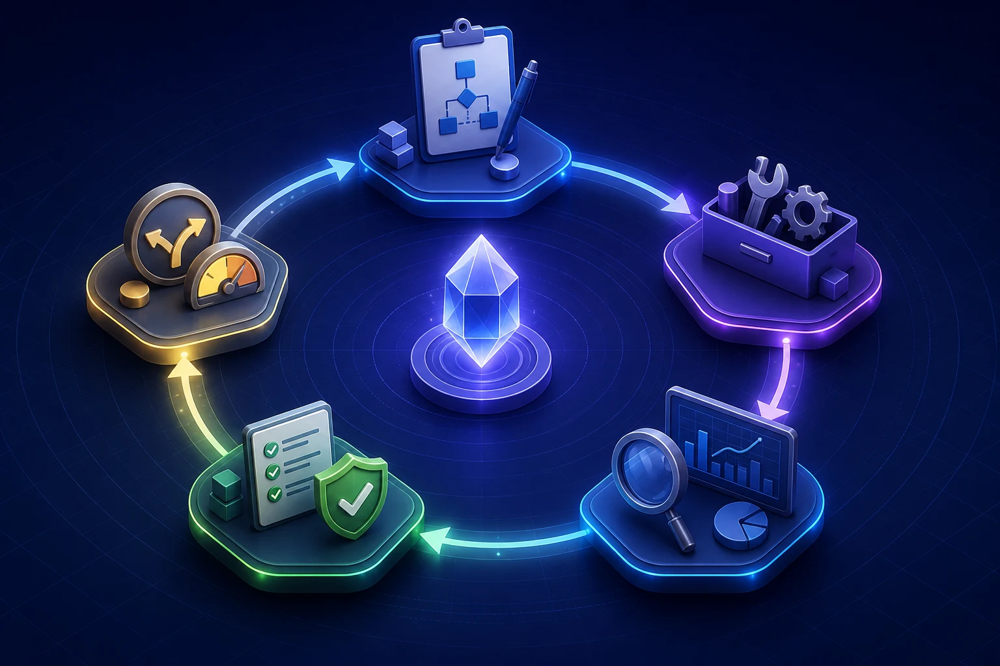

这篇笔记整理自我在阅读《[深入理解 AI Agent：设计原理与工程实践](https://github.com/bojieli/ai-agent-book)》时产生的一组连续追问。讨论的重点不是某个框架如何调用，而是 Agent 系统真正如何运转：**模型负责什么、Harness 负责什么、工具从哪里来、MCP 解决什么问题，以及怎样让 Agent 围绕目标可靠地持续工作。**

> 一句话先建立全局认识：**LLM 负责做语义判断，Harness 负责组织执行，Tool 负责改变或读取环境，MCP 只是把一部分外部能力接入 Harness 的标准协议。**


## 1. 给 Agent 设计的工具，都是预先封装在 Harness 里面的吗？

> **原问题：** 给 Agent 设计的工具都是预先封装在 Harness 里面的吗？

大体方向是对的，但“封装在里面”容易让人误以为所有工具的实现代码都写在 Harness 源码中。更准确的说法是：

> **Agent 能使用哪些工具，由 Harness 负责注册、暴露、约束和调度；工具的实现则既可以在 Harness 内部，也可以位于外部进程或远程服务中。**

在模型开始推理前，Harness 通常会准备一份工具清单。每个工具至少包含：

- 唯一名称，例如 `read_file`、`search_web`；
- 用途说明，告诉模型什么时候应该用它；
- 输入参数的结构，例如 JSON Schema；
- 执行入口，以及超时、权限和错误处理规则。

工具常见有三种来源：

| 来源 | 工具实现在哪里 | 例子 |
| --- | --- | --- |
| Harness 原生工具 | Harness 自身或配套运行时 | 读写文件、执行 shell、应用补丁 |
| MCP 工具 | 本地或远程 MCP Server | GitHub、Jira、数据库、企业知识库 |
| API / SDK 包装工具 | 自己写的函数或后端服务 | 天气 API、内部订单系统、搜索接口 |

因此，工具集合更像一个“函数注册表”：

```python
tools = {
    "read_file": read_file,
    "shell": run_shell,
    "search_web": web_search_adapter,
}
```

Harness 的关键价值不是亲自实现世界上的每一种能力，而是把来源不同的能力变成模型能理解、系统能安全执行的统一接口。

## 2. 这就是所谓的开放式工具调用吗？它会提升模型性能吗？

> **原问题：** 所以这就是所谓的开放式工具调用，能使用更多的外部工具来间接提升模型的性能表现？

这个理解基本正确，但“提升模型性能”最好再精确一点：

> **工具调用提升的是整个 Agent 系统的任务能力，不会直接改变底层模型的参数能力。**

一个模型不知道今天的天气，接入搜索工具后可以查到；它无法仅靠生成文本修改仓库，接入文件和 shell 工具后可以真正完成修改。但模型权重并没有因此更新。变化的是系统的动作空间：

```text
LLM 的理解与推理能力
        +
Harness 提供的上下文、状态和控制
        +
Tool 提供的感知与行动能力
        =
Agent 的整体任务能力
```

这和人使用计算器很像。计算器不会让人的大脑突然掌握更多心算参数，却会显著提高整套“人 + 工具”系统的计算范围与准确率。

不过，工具不是越多越好。工具说明互相重叠、参数含糊或返回值嘈杂时，模型更容易选错工具。可靠的开放式工具调用还依赖：

1. 清晰而互斥的工具描述；
2. 稳定、结构化的返回结果；
3. 合理的权限和确认机制；
4. 超时、重试、降级与错误反馈；
5. 对工具选择和执行轨迹的评估。

所以工具扩展的是 Agent 的能力边界，而 Harness 的设计决定这些新能力能否被稳定利用。

## 3. Harness 不是大模型，它怎么“找到”工具并自动执行？

> **原问题：** Harness 是怎么自行找到对应的工具并自动执行的？Harness 也不是大模型啊。

关键点正是：**Harness 不需要理解该用哪个工具。真正进行语义选择的是 LLM，Harness 做的是确定性的程序调度。**

一次典型工具调用可以拆成七步：

1. Harness 收集当前可用工具的名称、描述和参数结构；
2. Harness 把用户问题、上下文和工具定义一起交给模型；
3. 模型判断要不要使用工具，以及使用哪一个；
4. 模型返回结构化调用，而不是假装已经执行；
5. Harness 校验工具名、参数类型、权限和审批条件；
6. Harness 在注册表中找到真实执行函数并调用；
7. 执行结果作为 Observation 返回模型，模型再决定回答、继续调用或停止。

例如模型可能返回：

```json
{
  "name": "get_weather",
  "arguments": {
    "city": "宁波"
  }
}
```

Harness 的核心逻辑反而很朴素：

```python
call = model_response.tool_call

if call.name not in tools:
    return tool_error("unknown tool")

args = validate(call.arguments, tools[call.name].schema)
check_permission(call.name, args)
result = tools[call.name].execute(**args)
conversation.add_tool_result(call.id, result)
```

也就是说：

- **LLM 做模糊的语义判断**：用户意图是什么，下一步该调用哪个工具；
- **Harness 做确定的机械执行**：查表、校验、授权、调用、记录和返回；
- **Tool 做真实工作**：访问文件、搜索网页、查询数据库或调用服务。

所谓“自动找到”，通常不是 Harness 像搜索引擎一样在整个互联网发现工具，而是它从已经配置和连接的工具源中形成注册表，模型再从注册表里选择。

## 4. MCP Server 到底是什么？

> **原问题：** MCP Server 是什么玩意？

可以先记住一个最直观的定义：

> **MCP Server 是把某种外部数据或能力包装成标准接口，提供给 AI 应用调用的程序。**

MCP 是 Model Context Protocol。它采用 Host—Client—Server 架构：

- **MCP Host**：用户实际使用的 AI 应用或 Agent Harness；
- **MCP Client**：Host 内部维护连接的协议组件，通常一个 Client 对应一个 Server；
- **MCP Server**：对外提供 Tools、Resources、Prompts 等标准能力的程序。

其中最容易理解的是三个核心原语：

- **Tools**：可以执行的动作，例如创建 Issue、查询天气；
- **Resources**：可以读取的上下文，例如文件内容、数据库记录；
- **Prompts**：可复用的提示模板。

假设要让 Agent 查询公司数据库。没有 MCP 时，每个 Agent 框架可能都要自己写连接、鉴权、工具定义和返回值转换。使用 MCP 后，可以由一个数据库 MCP Server 暴露：

```text
list_tables
describe_table
query_database
```

不同的 MCP Host 都能用相同协议发现并调用这些能力。MCP 的价值不是让模型更聪明，而是降低系统之间重复适配的成本。

## 5. MCP Server 在哪里？

> **原问题：** MCP Server 在哪里呢？

它没有固定的物理位置。“Server”描述的是它在协议中的角色，不等于一定有一台远程服务器。


常见部署形态有两类：

### 本地 MCP Server

它是运行在用户电脑上的独立进程，Host 经常自动启动它，并通过标准输入输出（STDIO）通信。

```text
Codex / IDE / 桌面应用
        ↓ 启动子进程
本地 MCP Server
        ↓
本地文件、数据库或 CLI
```

这种方式适合访问本机资源，网络开销小，但必须严格控制文件权限与命令执行范围。

### 远程 MCP Server

它运行在互联网或公司内网，通过 Streamable HTTP 等传输方式与 Host 连接。

```text
Agent Host
    ↓ HTTPS + 鉴权
远程 MCP Server
    ↓
GitHub / Jira / SaaS / 企业内部系统
```

这种方式便于集中维护和多人共享，但需要处理 OAuth、API Key、网络边界、租户隔离和审计。

所以问“MCP Server 在哪里”，最准确的回答是：**先看 Host 的连接配置和传输方式；STDIO 多半是本地进程，HTTP 多半是远程服务。**

## 6. 程序凭什么会把可调用工具交给 Harness？这是后来适配出来的吗？

> **原问题：** 它凭什么会乖乖给 Harness 返回它能被调用的工具呢？是出现 Harness 之后各种程序进行适配的吗？

是的，核心就是“适配”。普通程序不会突然理解 MCP，更不会主动向所有 Agent 宣布自己的能力。必须有人编写 MCP Server，或者在原有服务前增加一层适配器。

以 GitHub 为例，底层真正做事的仍然可能是 GitHub API。MCP Server 的工作是：

1. 把底层 API 整理成面向 Agent 的工具；
2. 为工具提供名称、说明和输入 Schema；
3. 接收 `tools/list`，返回当前可用的工具定义；
4. 接收 `tools/call`，校验参数并调用真实 API；
5. 把执行结果转换成标准 MCP 响应。

因此，工具来源一般是：

- 服务提供方自己维护官方 MCP Server；
- 第三方开发者包装已有 API；
- 企业为内部系统编写私有 MCP Server；
- Agent 产品直接内置适配，不通过 MCP。

这里还要区分“发现”和“连接”：MCP 支持在**已连接的 Server** 上通过 `tools/list` 动态获取能力，但 Host 通常仍要先知道 Server 的地址、启动命令和认证信息。它不是默认遍历互联网、随便找到陌生服务就执行。

## 7. 网页端模型是怎么调用工具的？

> **原问题：** 网页端的模型是怎么调用工具的呢？

网页端和桌面 Agent 的基本逻辑一致，只是 Harness 大多运行在网站后端，浏览器主要负责输入、显示进度和接收流式结果。

```text
用户浏览器
   ↓ 用户请求
网站后端 / Agent Runtime
   ↓ 携带工具定义调用模型
LLM 返回 tool call
   ↓
网站后端执行搜索、代码沙箱或业务 API
   ↓ tool result
LLM 根据结果继续推理
   ↓
浏览器流式显示最终答案
```

例如用户问“宁波明天会不会下雨”：

1. 浏览器把问题发到网站后端；
2. 后端把问题和 `web_search` 或天气工具描述交给模型；
3. 模型返回结构化工具调用；
4. 后端访问搜索服务或天气 API；
5. 后端把结果交还模型；
6. 模型组织自然语言答案；
7. 网页把答案展示给用户。

所以并不是模型权重自己发 HTTP 请求。真正掌握网络凭据、执行工具和保存状态的是后端 Runtime。这样也能避免把敏感 API Key 暴露到浏览器。

当然也有例外：浏览器扩展、Computer Use 或本地助手可能在用户设备上执行一部分动作。但即使如此，仍然需要某个运行时负责权限、确认、事件传递和结果回填。

## 8. Responses API 的内置工具、Kimi Agent 与 Harness 是什么关系？

> **原问题：** 比如阿里云百炼 Qwen3.7-plus 的 Responses API 同样内置 `web_search` 与 `code_interpreter`；Kimi K3 的 Formula 也就是 Harness 的思想，只是没有具体到 Claude Code、Codex 这种完全落地的 App？

整体方向是对的：这些产品都体现了“**模型之外还需要工具和运行时**”的思想。但不能把模型 API、Agent Runtime、Harness 和最终 App 完全画等号。

更清楚的分层是：

```text
第 1 层：模型
Qwen / Kimi K3 / GPT
负责生成、推理和工具选择

第 2 层：模型服务与工具运行时
Responses API、内置 web_search、code_interpreter
负责协议、状态衔接和托管工具执行

第 3 层：Agent Harness
负责上下文、工具注册、循环、权限、沙箱、恢复、验证与观测

第 4 层：完整应用
Codex、Claude Code、Kimi Agent 等
负责交互界面、项目管理、用户体验和具体工作流
```

阿里云百炼官方文档显示，Qwen3.7-plus 可以在 Responses API 的 `tools` 参数中启用 `web_search`、`web_extractor` 与 `code_interpreter`。这说明它提供的已经不是“裸模型调用”，而是一部分托管 Runtime 能力。

但一个完整 Harness 通常还包括：工作目录、文件读写策略、命令审批、失败恢复、长任务状态、上下文压缩、测试验证、成本预算和可观测性。仅仅拥有两个托管工具，还不能自动等同于 Codex 这类完整 Coding Agent。

对于 Kimi，也应该区分 K3 模型、Kimi API、Kimi Agent 和具体的 Agent/Swarm 产品。若这里的 Formula 指工具编排或执行配方，它确实与 Harness 思想相通；但是否构成“完整 Harness”，要看它有没有真正承担上述运行控制职责，而不能只根据名称下结论。

一个很实用的判断方法是问：

> 它只是告诉模型“有工具可用”，还是还负责“工具怎样安全执行、状态怎样延续、失败怎样恢复、结果怎样验证、任务何时停止”？

后面这些，才是 Harness 工程最有分量的部分。

## 9. Loop Engineering 是什么意思？

> **原问题：** 最近新出现的 Loop Engineering 概念是什么意思？我的理解是给模型一个 Goal，模型围绕这个 Goal 进行多轮执行任务来完成目标。

这个理解已经抓住了核心：

> **给 Agent 一个目标，不再由人逐步提示，而是让系统反复“计划—行动—观察—验证—修正”，直到有证据表明目标完成，或触发停止条件。**

但 Loop Engineering 的重点不只是“允许多轮”，而是**把循环本身当作工程对象来设计**。



一个可靠的循环至少要回答这些问题：

| 组成 | 要回答的问题 |
| --- | --- |
| Goal | 最终要达到什么可观察状态？ |
| Trigger | 什么时候启动？由人、事件还是定时任务触发？ |
| Planner | 下一轮做什么？如何拆分任务？ |
| Context / State | 每轮应该看到什么？哪些历史要保存或压缩？ |
| Tools | Agent 能采取哪些动作？权限边界在哪里？ |
| Observation | 怎样获得真实环境反馈？ |
| Verifier | 用测试、规则、外部证据还是另一个评审者验收？ |
| Recovery | 工具失败、网络中断、方案走偏时怎么办？ |
| Stop condition | 什么算完成、阻塞或失败？ |
| Budget | 最多允许多少轮、时间、Token 和费用？ |

以“为项目增加登录功能，并保证测试通过”为例：

```text
Goal：登录功能满足需求，相关测试全部通过
  ↓
读取代码与需求
  ↓
制定计划并实现
  ↓
运行测试和静态检查
  ↓
Verifier 检查证据
  ├─ 未通过：把失败信息加入下一轮上下文，修复后重试
  ├─ 需求不完整：补齐实现，再验证
  ├─ 无进展或超预算：停止并请求人工处理
  └─ 测试与要求均满足：DONE
```

以前，人往往亲自充当外层循环：看结果、判断问题、再发下一条 Prompt。Loop Engineering 的目标，是把这套推进逻辑变成可复用、可观察、有限制的系统。

### Agent Loop 和 Loop Engineering 不是一回事

Harness 内部本来就可能有一个基础循环：

```text
LLM → Tool call → Tool result → LLM → Tool call → ...
```

它解决的是“这一轮模型与工具怎样来回交互”。Loop Engineering 更关注外层控制：一个长期目标如何被反复推进，如何独立验证，什么条件下继续、停止、回滚或交给人。

```text
外层 Loop Specification
├─ Goal
├─ Trigger
├─ Verification
├─ Memory
├─ Stop rule
└─ Budget
        ↓
  交给 Agent Harness
        ↓
  内层模型—工具循环
```

### 最危险的错误：让 Agent 自己宣布“我完成了”

模型输出“已经完成”只是一项声明，不是证据。更可靠的停止条件应尽量绑定可机械验证的事实：

- 测试命令返回成功；
- 产物文件存在且 Schema 合法；
- 页面关键流程通过浏览器测试；
- 需求清单逐项有对应证据；
- 高风险操作通过人工审批；
- 连续若干轮没有进展时停止，而不是无限重试。

因此，Loop Engineering 最重要的两块往往不是 Planner，而是 **Verifier 和 Stop Condition**。没有验证的循环只是反复生成，没有预算与停止规则的循环则可能演变成失控的成本和副作用。

### Prompt、Context、Harness 与 Loop Engineering 的关系

可以用四个问题区分它们：

```text
Prompt Engineering：这一条指令怎样表达？
Context Engineering：这一轮模型应该看到什么？
Harness Engineering：模型如何拥有工具、状态、权限和执行环境？
Loop Engineering：系统如何围绕目标持续运行、验证并停止？
```

它们不是互相替代的新名词，而是从单次模型调用逐步扩展到长期 Agent 系统的不同工程层。

## 10. 所有工具调用都要经过 MCP 吗？Codex 执行 PowerShell 也需要 MCP 吗？

> **原问题：** 所有工具调用都要通过 MCP 吗？有没有可以写在 Harness 内部本身的工具？比如 Codex 中，模型想要在 PowerShell 里面执行一些命令还需要通过 MCP 吗？

不需要。**MCP 是外部工具接入 Harness 的一种标准协议，不是所有 Tool 的强制中间层。**

工具可以这样分类：

```text
Tool
├─ Native Tool：Harness 原生提供
│  ├─ shell
│  ├─ read_file / write_file
│  └─ apply_patch
├─ MCP Tool：MCP Server 提供
│  ├─ GitHub
│  ├─ Jira
│  └─ 企业数据库
└─ API / SDK Tool：普通函数包装
   ├─ weather API
   └─ 内部业务服务
```

在 Coding Agent 中，shell 很适合做成原生工具。假设模型决定执行 `git status`，流程可以是：

```text
LLM
 ↓ 返回 shell tool call
Codex Harness
 ↓ 校验命令与权限
原生 shell 工具
 ↓
Windows 沙箱 / PowerShell
 ↓ 执行 git status
stdout / stderr
 ↓
Codex Harness
 ↓
LLM 读取结果并决定下一步
```

这条链路完全不要求存在 MCP Server。OpenAI 的模型工具说明也把 Hosted shell 与 MCP 分列为不同工具类型，这本身就说明两者是并列能力，而不是“shell 必须套一层 MCP”。

对 Coding Agent 来说，shell 还是一个“超级工具”：

```text
shell
├─ git
├─ python / pytest
├─ npm / pnpm
├─ cargo / cmake
├─ docker
└─ PowerShell cmdlet 与其他 CLI
```

只要 Harness 安全地提供一个 shell，模型就能复用电脑里大量既有 CLI，而不必为 `git_tool()`、`pytest_tool()`、`npm_tool()` 分别设计协议。

那为什么仍然需要 MCP？因为 Jira、Slack、Notion、Salesforce、Figma、企业数据库等系统并不是 Coding Agent 的本机核心环境。让每个 Harness 团队分别维护所有 SaaS 适配器，成本很高。MCP 让 Harness 实现一次 Client，就能按统一方式接入许多 Server。

最终可以记成：

> **Tool 是能力本身；MCP 是把一部分外部 Tool 接入 Harness 的标准方式。Tool 不等于 MCP Tool。**

## 总结：把几个最容易混淆的概念放回正确位置

| 概念 | 核心职责 | 不负责什么 |
| --- | --- | --- |
| LLM | 理解意图、推理、选择下一步和生成参数 | 不直接执行真实世界动作 |
| Harness | 组装上下文、注册工具、管理状态与循环、执行安全策略 | 不靠自身“理解”用户语义 |
| Tool | 读取或改变环境 | 不决定整个任务策略 |
| MCP | 标准化 Host 与外部 Server 的连接和能力交换 | 不是所有工具的强制通道 |
| MCP Server | 把特定数据或操作暴露成 Tools / Resources / Prompts | 不一定在远程，也不一定包含模型 |
| Loop Engineering | 设计围绕 Goal 的长期推进、验证、恢复和停止机制 | 不只是“多调用几次模型” |

把整条链路压缩成一幅文字图，就是：

```text
用户给出 Goal
   ↓
Harness 组织 Context、State、Tools、Permissions 与 Loop
   ↓
LLM 选择下一步 Action
   ↓
Harness 调用原生工具 / MCP 工具 / API 工具
   ↓
Environment 返回 Observation
   ↓
Verifier 检查证据
   ├─ 未完成：更新上下文，继续下一轮
   ├─ 阻塞或超预算：停止并请求人工处理
   └─ 满足条件：DONE
```

真正的 Agent 能力不只来自“更聪明的模型”，也来自 Harness 打开的动作空间、工具适配的质量，以及循环是否有可靠的验证和停止规则。

## 参考资料

- [《深入理解 AI Agent：设计原理与工程实践》开源仓库](https://github.com/bojieli/ai-agent-book)
- [Model Context Protocol：Architecture overview](https://modelcontextprotocol.io/docs/learn/architecture)
- [Model Context Protocol：Tools specification](https://modelcontextprotocol.io/specification/2025-06-18/server/tools)
- [OpenAI API：GPT-5.6 Sol 支持的工具类型](https://developers.openai.com/api/docs/models/gpt-5.6-sol)
- [阿里云百炼：Qwen Responses API 与内置工具](https://help.aliyun.com/zh/model-studio/qwen-api-via-openai-responses)
- [Kimi Help Center：Kimi Agent overview](https://www.kimi.com/help/agent/agent-overview)
- [Addy Osmani：Loop Engineering](https://addyosmani.com/blog/)
- [LangChain：The Art of Loop Engineering](https://www.langchain.com/blog/the-art-of-loop-engineering)
- [Stop Hand-Holding Your Coding Agent：Loop Specification 论文](https://arxiv.org/abs/2607.00038)
