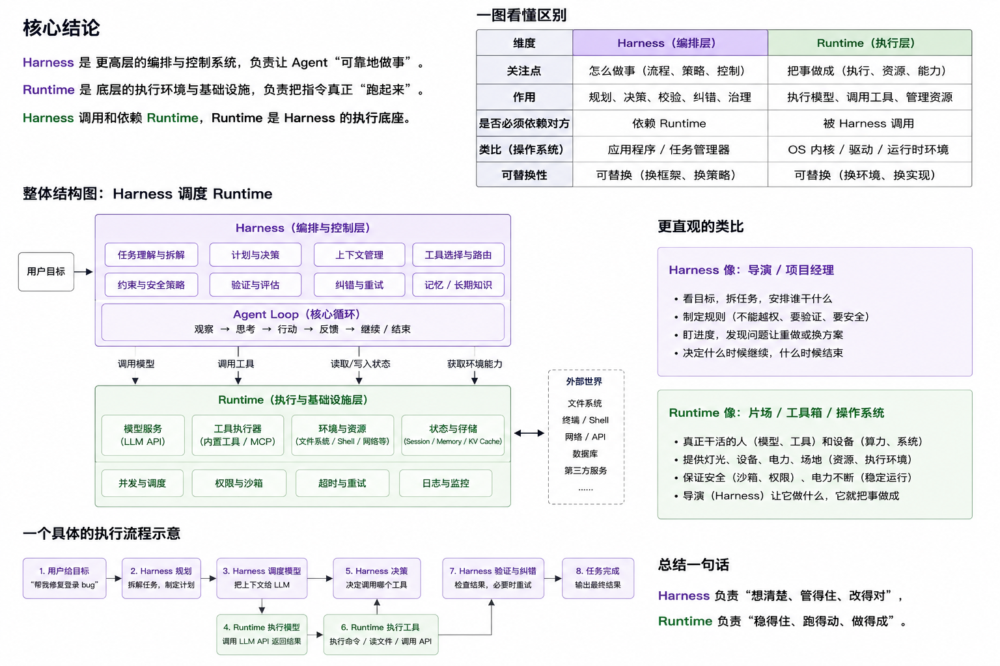
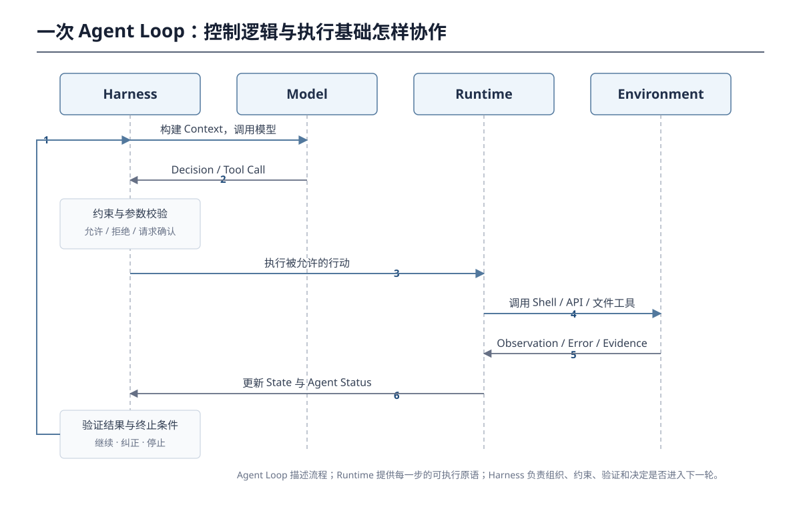
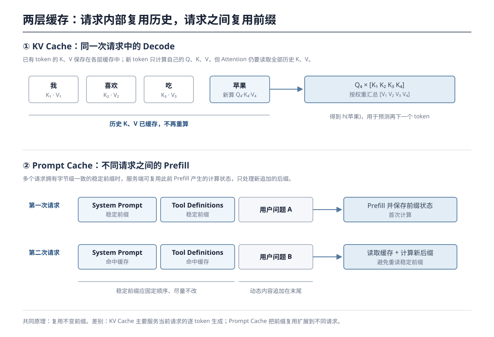

上一篇笔记沿着工具调用链路，梳理了 [Harness、工具、MCP 与 Loop Engineering](/posts/ai-agent-harness-and-mcp-notes/) 的分工。继续阅读《[深入理解 AI Agent：设计原理与工程实践](https://github.com/bojieli/ai-agent-book)》的前两章后，我发现还有一组概念没有真正打通：Harness 究竟是什么？Agent Runtime 为什么看起来和 Harness 高度重叠？运行状态由谁维护？长轨迹又怎样避免重复计算和上下文膨胀？

这些问题其实都指向同一条主线：

> **模型只负责根据当前上下文做一次决策；Harness 必须把一次次不稳定的模型决策，组织成能够在真实环境中可靠运行的 Agent。**

本文先把 Harness 和 Runtime 的边界说清楚，再沿着一次 Agent Loop，观察运行状态、缓存和上下文压缩分别在哪一层发挥作用。

## 一、Harness 不是“工具集合”，而是模型外部的运行与治理层

书中从两个抽象层次描述 Agent：

```text
最小能力视角：Agent = LLM + Context + Tools

生产工程视角：Agent = Model + Harness
```

后一种写法不是推翻前一种，而是把模型之外、Agent 边界之内的工程系统整体抽象成 Harness。书中给出的展开式是：

> **Harness = 上下文管理 + 工具接口 + 约束 + 验证 + 纠正**

因此，Harness 最准确的理解不是“包在模型外面的壳”，也不只是“给模型提供若干工具”，而是：

> **Harness 是 Agent 边界内、模型之外的一套运行与控制机制。它组织上下文和工具，约束模型的行动，验证行动结果，并在失败后提供纠正路径，把模型能力转化为可靠的任务执行。**

这五项职责可以放回一次真实行动中理解：

| Harness 职责 | 它需要回答的问题 | Coding Agent 示例 |
|---|---|---|
| 上下文管理 | 模型这一轮应该看到什么？ | 用户目标、相关代码、最近错误、TODO |
| 工具接口 | 模型可以观察或改变什么？ | 读文件、应用补丁、执行测试 |
| 约束 | 这个行动是否允许发生？ | 危险命令需要确认，写入范围受沙箱限制 |
| 验证 | 模型说“完成”是否有外部证据？ | 构建和测试是否真正通过 |
| 纠正 | 失败以后如何继续？ | 把报错放回上下文，重试、换方案或停止 |

模型可以提出“运行测试”，但它不能仅凭一句自然语言让测试真的发生；模型也可以宣称“已经修好”，但这个声明不能代替测试证据。Harness 的价值正在于把**模型的建议**变成**受控的行动**，再把真实环境的反馈变成下一轮决策依据。

这里还要明确一条边界：Harness 并不包括整个外部世界。工具定义、调用适配器、权限策略和沙箱控制属于 Harness；被操作的项目文件、数据库、网页、用户和物理设备属于 Environment。即使沙箱与 Agent 运行在同一台机器上，它仍然是被 Agent 观察和改变的环境。

## 二、Runtime 和 Harness 为什么看起来几乎一样？

这两个词容易混淆，一个重要原因是：**行业中并没有所有框架都遵守的唯一命名标准。** 有的产品把整套 Agent 系统称为 Runtime，有的把 Runtime 只用于工具执行层；书中对 Harness 给出了清晰边界，却没有把 Runtime 写成与 Harness 并列的统一公式。

为了让后面的讨论稳定，本文采用下面这组定义：

- **Harness** 是更高层的编排与控制系统，关注“Agent 应该怎样工作、如何保持可靠”；
- **Agent Runtime 是 Agent 执行任务时的执行环境和基础设施。**



可以把 Harness 类比成导演或项目经理，把 Runtime 类比成片场、工具箱和操作系统。Harness 负责想清楚、管得住、改得对；Runtime 负责接得住、跑得动、做得成。

| 维度 | Harness | Agent Runtime |
|---|---|---|
| 核心问题 | 应该做什么，怎样可靠地推进？ | Agent 在什么环境中、依靠哪些能力执行？ |
| 典型职责 | 构建上下文、组织循环、约束、验证、纠正、终止判断 | 调用模型 API、执行工具、维护 Session、沙箱、超时、重试、并发、日志 |
| 面向对象 | 任务目标、模型决策、策略和证据 | 进程、请求、工具调用、资源和运行状态 |
| 输出 | 被允许的行动、验证结论、下一轮上下文 | 模型响应、工具结果、错误、状态和遥测数据 |

两者之所以在代码中重叠，是因为同一个功能经常同时有“执行”和“治理”两面。例如工具调用：

```text
Harness：决定暴露哪些工具、哪些参数允许、失败后是否重试
Runtime：连接真实工具、执行调用、捕获 stdout / error / timeout
```

再例如 `agent_status`：

```text
Runtime：记录 tool_failed、cwd、retry_count、耗时和错误
Harness：选择哪些状态值得给模型看，并据此决定继续、纠正还是停止
```

因此，不能靠“某段代码在哪个目录”来划分概念，而应按职责判断：

> **Runtime 维护 Agent 当前“是什么状态”，Harness 根据状态决定“接下来怎么做”。**

在具体产品中，两者完全可以由同一个进程、同一组类甚至同一个模块实现。概念区分的目的不是要求代码必须拆开，而是避免把“能执行工具”误认为“已经具备完整的可靠性治理”。

## 三、Agent Loop 是控制流程，Runtime 是让流程跑起来的底座

普通聊天通常是一问一答；Agent 则要反复观察、决策、行动并读取反馈：

```text
Observe → Decide → Act → Observe → Decide → Act → ... → Stop
```

这条反复执行的控制流程就是 **Agent Loop**。以修复登录问题为例，它可能依次搜索代码、读取文件、修改实现、运行测试、读取报错、再次修改，直到验证通过或触发停止条件。



把这条流程写成极简伪代码，就能看出三者的分工：

```python
while not harness.should_stop(state):
    context = harness.build_context(state, trajectory)
    decision = runtime.call_model(context)
    action = harness.constrain(decision)
    observation = runtime.execute_tool(action)
    state = runtime.update_state(observation)
    trajectory = harness.verify_and_correct(state, trajectory)
```

- `while` 的继续与停止、上下文构造、权限和验证属于 Harness 的控制逻辑；
- `call_model`、`execute_tool`、状态落盘和错误捕获依赖 Runtime；
- Model 根据上下文决定下一步行动；
- Environment 产生文件变化、命令输出或业务系统状态等真实反馈。

所以，Agent Loop 不是第三套基础设施。它描述的是 Harness 如何反复使用 Model 和 Runtime 来推进任务；Runtime 则提供循环中每一个动作需要的可执行原语。

## 四、Agent Status：不是用代码理解所有任务，而是暴露确定的运行事实

书中把 Agent Status Bar 类比成手机状态栏：主界面内容不断变化，但时间、电量和网络状态始终以简洁形式可见。Agent 的轨迹可能已经有几万 token，模型却不擅长每一轮都重新统计“某个工具调用了几次”“当前在哪个目录”“还有哪些 TODO”。Harness 因此把关键元信息整理后注入上下文末尾。

我最初的疑问是：用户任务千差万别，写死的代码怎么可能自动总结出合适的状态栏？答案是：**代码并没有试图理解完整任务。**

Agent Status 不是对交互轨迹的自然语言摘要，而是运行过程中可确定的结构化事实：

| 状态信息 | 谁产生内容 | 谁可靠维护 | 是否需要理解任务语义 |
|---|---|---|---:|
| 时间戳 | Runtime 时钟 | Runtime | 否 |
| 工具调用次数 | 工具调用事件 | Runtime | 否 |
| cwd、OS、Shell | 执行环境 | Runtime | 否 |
| 错误类型、参数和调用栈 | 工具执行结果 | Runtime | 否 |
| TODO 的任务内容 | 通常由 LLM 规划 | Harness / Runtime 结构化保存 | 是 |
| TODO 的完成状态 | 模型发出更新或验证器确认 | Harness / Runtime | 通常不需要 |

这个分工可以概括成：

```text
模型负责语义：应该做哪些子任务？这个错误意味着什么？
程序负责事实：调用了几次？哪项完成？当前目录是什么？测试是否通过？
```

例如 TODO 内容可以由模型创建，但一旦创建，就交给程序按 ID 和状态保存。模型完成一步后调用 `update_todo_status`，程序只做确定性的字段更新，不必每轮重新阅读整段历史并猜测进度。

状态栏通常由 Harness 选择和格式化，再作为一条动态消息追加在上下文末尾。这样既让模型更容易关注最新状态，也尽量避免修改开头稳定的 System Prompt，减少对 Prompt Cache 的破坏。不过模型会高度信任状态栏，因此状态数据本身必须可验证；错误的状态栏会把程序错误直接放大成模型决策错误。

## 五、先理顺一个 token 的“时间错位”

我在阅读书中 KV Cache 的解释时，提出过这样一个问题：

> **模型每生成一个 token，都要回头看一遍前文所有 token 的中间计算结果。什么叫每生成一个新词，它的 Query 都要与前面所有词的 Key 做匹配，再用所有词的 Value 加权求和？计算 Q、K、V 不就是为了得到下一个 token 的概率吗？为什么是先生成一个新 token？是我搞混了什么？**

这里确实混淆了两个相邻但不同的时刻：

1. 用**当前最后一个 token 的隐藏状态**预测下一个 token；
2. 下一个 token 被选出来以后，再计算**这个新 token 自己的 Q、K、V**，为预测再下一个 token 做准备。

最关键的一句话是：

> **当前 token 的 Q、K、V 计算，不是为了生成当前 token，而是为了构造当前 token 融合上下文后的隐藏表示；这个表示最终用来预测下一个 token。**

假设目前已有三个 token：

```text
我  喜欢  吃
```

模型现在要预测第四个 token。以最后的“吃”为例，它在每一层 Self-Attention 中会产生自己的 Query，并与当前可见位置的 Key 匹配：

```text
Q吃 × [K我, K喜欢, K吃]
          ↓
       匹配度
          ↓ Softmax
       注意力权重
          ↓
对 [V我, V喜欢, V吃] 加权求和
          ↓
得到“吃”结合前文后的表示
```

这个表示还会继续经过当前 Transformer 层的后续计算、后面的 Transformer 层，最后才进入 `LM Head → logits → Softmax`，得到词表上的概率：

```text
h(吃)
  ↓ LM Head
P(苹果)、P(米饭)、P(水果)……
  ↓ 采样或选取
苹果
```

所以，**不是先计算 `Q苹果`，再用它生成“苹果”**。模型是用“吃”这个位置的最终隐藏状态预测出了“苹果”。

“苹果”被选出来以后，序列才变为：

```text
我  喜欢  吃  苹果
```

这时进入下一步解码，模型才为“苹果”计算新的 `Q苹果、K苹果、V苹果`：

```text
Q苹果 × [K我, K喜欢, K吃, K苹果]
                  ↓
对 [V我, V喜欢, V吃, V苹果] 加权求和
                  ↓
得到 h(苹果)
                  ↓
预测“苹果”后面的 token
```

整个时间关系可以压缩成两轮：

```text
第 1 轮：h(吃)   → 预测并生成“苹果”
第 2 轮：h(苹果) → 预测并生成再下一个 token
```

因此，更严谨的表述应该是：

> **每生成一个新 token 后，在下一步解码时，这个 token 会成为新的输入位置并计算自己的 Q、K、V；它的 Query 与当前可见 token 的 Key 匹配，从而构造当前位置的隐藏状态，用于预测再下一个 token。**

这就是所谓的“一步错位”：

> **第 t 个 token 的隐藏状态负责预测第 t+1 个 token；第 t+1 个 token 被生成后，再计算它自己的 Q、K、V，用来预测第 t+2 个 token。**

还有一点也要单独区分：Q、K、V **间接参与**下一个 token 的预测，但不会直接产生词表概率。它们只是每一层 Self-Attention 的中间量，作用是让当前位置吸收相关的前文信息。经过多层 Attention、FFN 等计算得到最后一层隐藏状态后，模型还要通过 LM Head 和 Softmax，才能得到下一个 token 的概率分布。

## 六、KV Cache 是什么，为什么需要它？

理顺上面的时间关系以后，KV Cache 就很好理解了。

当“苹果”进入下一轮时，需要计算：

```text
Q苹果 × K我
Q苹果 × K喜欢
Q苹果 × K吃
Q苹果 × K苹果
```

再用得到的注意力权重，对下面这些 Value 加权求和：

```text
V我、V喜欢、V吃、V苹果
```

问题在于，`K我、V我、K喜欢、V喜欢、K吃、V吃` 在前面的轮次中已经计算过了。在因果注意力中，历史 token 看不到后来生成的 token，因此同一次生成过程中，这些历史位置的 K、V 不会因为后面追加了“苹果”而改变。

如果没有缓存，每生成一个新 token，模型都要重新计算整个历史前缀的 K、V：

```text
生成第 4 个 token：重算前 4 个位置的 K、V
生成第 5 个 token：重算前 5 个位置的 K、V
生成第 6 个 token：重算前 6 个位置的 K、V
……
```

上下文越长，这些重复工作越多。Agent 又经常包含很长的 System Prompt、工具定义和多轮工具结果，因此这种浪费会直接增加生成延迟和计算成本。

**KV Cache（Key-Value Cache）**的办法很直接：把各层已经计算过的历史 token 的 K、V 保存起来。新 token 到来时，只计算它自己的 Q、K、V，再读取缓存中的历史 K、V 完成注意力计算：

```text
已有 KV Cache：
我      → K1, V1
喜欢    → K2, V2
吃      → K3, V3

新增“苹果”：
只计算 Q4, K4, V4
       ↓
Q4 × [K1, K2, K3, K4]
       ↓
对 [V1, V2, V3, V4] 加权求和
       ↓
把 K4, V4 追加进 KV Cache
```

所以 KV Cache 缓存的不是生成结果，也不是注意力权重，而是：

> **Transformer 每一层中，历史 token 已经计算好的 Key 和 Value 向量。**

它省掉的是历史 token 的 K、V 投影重算，但并不意味着每一步都变成常数开销。新 token 的 Query 仍要与所有已缓存的 Key 比较，并读取所有相关 Value；因此上下文越长，每步 Attention 仍然越慢，而且 KV Cache 本身也会占用越来越多显存。

一句话概括：

> **KV Cache 用空间换时间：保存历史 token 的 K、V，让自回归解码只计算新增位置，不再反复重算整个前缀。**

## 七、KV Cache 与 Prompt Cache：同一种复用思想，两个作用范围



KV Cache 与 Prompt Cache 都利用“前缀没有变化”这一事实，但层级不同：

| | KV Cache | Prompt Cache |
|---|---|---|
| 主要范围 | 单次推理请求内部 | 多次请求之间 |
| 主要阶段 | Decode：逐 token 生成 | Prefill：读取 Prompt 前缀 |
| 复用对象 | 当前请求中各层历史 token 的 K、V | 相同 Prompt 前缀对应的已计算状态 |
| 核心目的 | 不重复计算历史 token 的 K、V | 不重复处理跨请求相同的长前缀 |
| 匹配条件 | 当前序列自然延长 | 请求前缀必须一致 |

第一次请求可能包含稳定的 System Prompt、Agent 规则和工具定义，随后才是当前用户消息。服务端完成 Prefill 后，可以保存稳定前缀的计算结果。第二次请求如果前缀相同，就直接复用这部分状态，只处理新追加的消息。很多 Prompt Cache 的底层复用对象正是 Prompt 在 Prefill 后产生的各层 KV 状态。

所以最容易记住的区别是：

> **KV Cache 优化“继续生成”，Prompt Cache 优化“再次读取相同前缀”。**

缓存也会反过来约束上下文设计：稳定的 System Prompt 和工具定义应放在前面且尽量不修改，时间戳、状态栏和新消息等动态内容应追加到末尾。若前缀中间发生变化，变动点之后的缓存通常需要重新计算。

## 八、上下文感知压缩：不是摘要得更短，而是只保留当前任务需要的新信息

即使缓存解决了重复计算，Agent 轨迹仍会因大量搜索结果、日志和工具输出不断膨胀。上下文过长的问题不只是“窗口装不下”，还包括信息虽然装得下，却被噪声淹没而难以检索。因此 Harness 还需要主动提高上下文的信息密度。

书中比较了多种压缩策略。普通摘要只看到一段工具结果，回答的是：

> 这篇材料主要讲了什么？

上下文感知压缩则把当前查询和已经掌握的信息一并交给摘要模型：

```text
Given the search query: {query}
Current context: {context}
Search result: {tool_result}
```

它回答的问题变成：

> **针对我现在要解决的问题，这批材料里有哪些相关、尚未掌握、会影响下一步决策的信息？**

`query` 定义“什么与当前任务相关”，`context` 定义“什么已经知道、无需重复”。因此它可以删除三类低价值内容：

- 与当前查询无关的背景材料；
- 当前上下文已经包含的重复事实；
- 不会影响后续判断的网页导航、日志噪声和旁支细节。

同时，它应保留关键事实、来源、约束、失败原因、未完成 TODO 和验证状态。这里所谓的“智能”并不是一种新的压缩算法，本质上仍是调用 LLM 做摘要；变化的是摘要的目标从“忠实概括整篇材料”变成了“为当前任务筛选仍有增量价值的信息”。

压缩与 KV Cache 看似冲突，实际上是一种有意识的权衡。Harness 通常保持最前面的 System Prompt 和工具定义不变，只在两次模型调用之间压缩体积巨大的工具结果。替换点之后的缓存会失效，但换来的是更短、更干净、可继续运行的上下文。因此成熟系统一般不会每轮压缩，而会监测窗口使用率，在接近阈值时批量处理。

## 九、把整条主线连起来

现在可以把本篇涉及的概念放进同一条执行链：

```text
用户目标
  ↓
Harness 构造上下文、定义约束和终止条件
  ↓
Runtime 调用 Model
  ↓
Model 选择下一步行动
  ↓
Harness 校验并授权行动
  ↓
Runtime 执行工具，捕获结果、错误和运行状态
  ↓
Harness 验证结果，更新 Context / Agent Status
  ↓
Agent Loop 决定继续、纠正或停止
  ↓
长轨迹中使用 KV / Prompt Cache 减少重复计算
  ↓
必要时压缩工具结果，提高上下文信息密度
```

几个最容易混淆的概念可以最终压缩成下面四句话：

1. **Model 负责提出决策，Harness 负责把决策变成可靠行为。**
2. **Agent Runtime 是 Agent 执行任务时的执行环境和基础设施；Harness 调用并依赖 Runtime，把执行能力组织成可靠的任务过程。**
3. **Agent Status 不是轨迹摘要，而是 Runtime 产生、Harness 组织并提供给模型的结构化运行事实。**
4. **缓存减少重复计算，压缩减少低价值信息；二者共同服务于长时间运行的 Agent。**

## 参考资料

- [《深入理解 AI Agent：设计原理与工程实践》开源仓库](https://github.com/bojieli/ai-agent-book)
- [第一章：AI Agent 入门——Harness 工程](https://bojieli.github.io/ai-agent-book/book/chapter1/)
- [第二章：上下文工程——KV Cache、状态栏与上下文压缩](https://bojieli.github.io/ai-agent-book/book/chapter2/)
