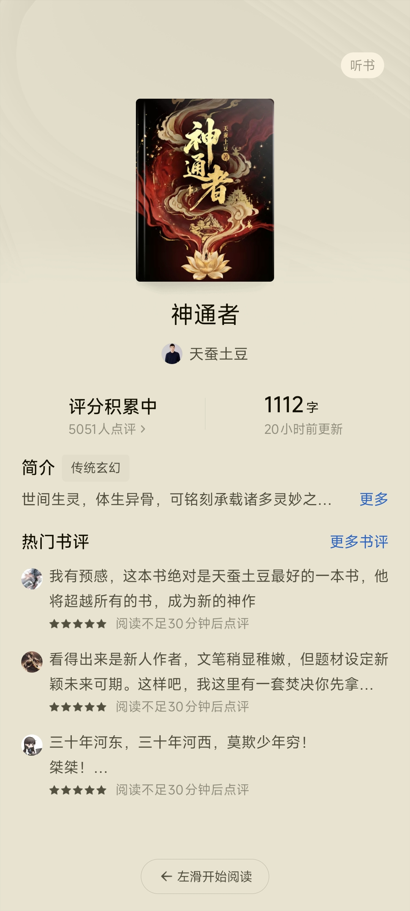
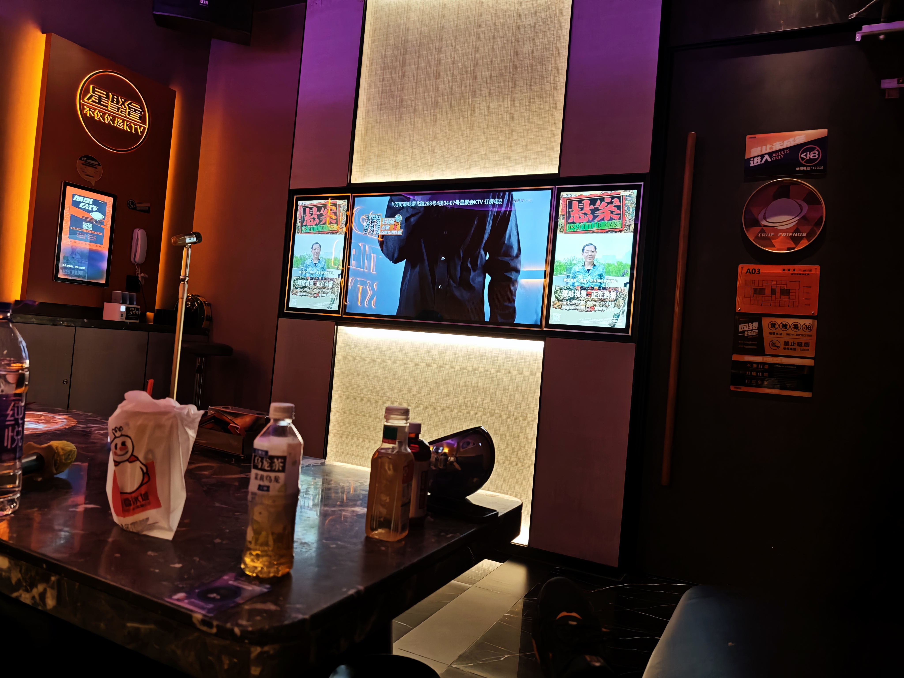
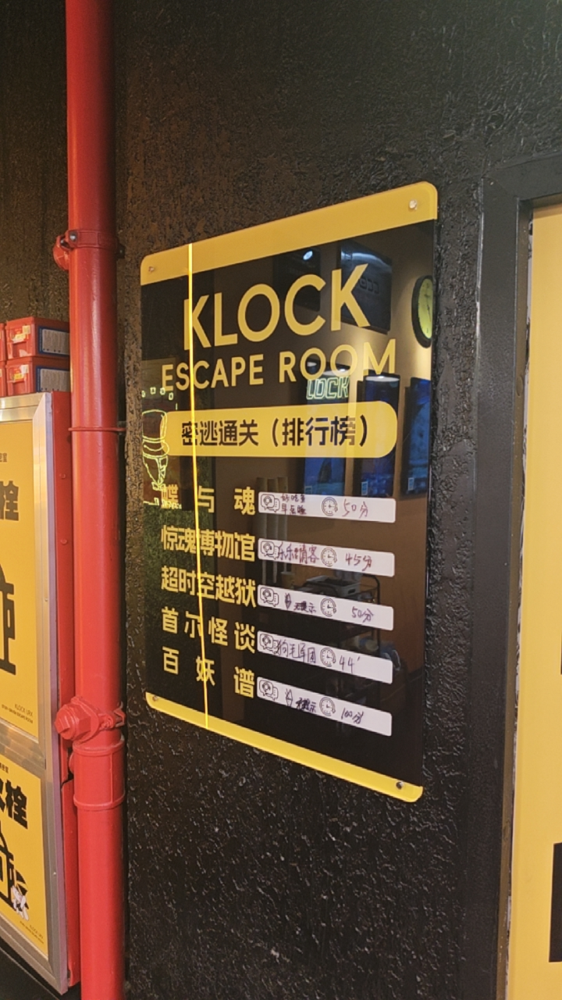
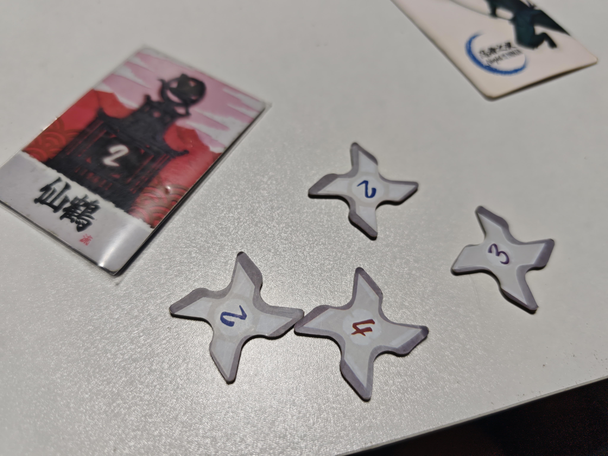

现在是25号的凌晨两点，我坐在一个人的宿舍的椅子下，脑子里还是刚刚才结束的实验室团建，大家真的很好，团建的氛围也很棒，很高兴能认识这么一群人，老师还给我们报销了，最喜闻乐见的一集，值得记录一下！

## 面见老师

7月23号的早上，又是稀疏平常的一天，我九点15分的闹钟，硬是拖到了九点半才起床，真的是松懈了，哎。来这里一周多了，老师像是消失了一样，一直没来过实验室，我从没线下见过老师，导致我起床去实验室的时间越拖越晚，本来九点半应该到实验室了，结果我才刚起床。回想一周前，我刚到的时候我甚至还会提前几分钟到实验室，果然没有压力就没有动力，人就是一种喜欢偷懒的生物，或许只是我这样，泵。

像往常一样，我洗脸刷牙，收拾电脑，慢慢悠悠，不紧不慢的走向实验室的大楼。九点五十分我就到达了实验室，你问我为什么这么快，因为我没吃早餐，直接过去了。当然不是因为我急得来不及吃了，是因为这个点饭堂的早餐只剩了一点残渣，不如不吃，还得绕点路，反正也不怎么饿，bush。现在回想起来，这个选择简直拯救了我，看来懒惰的天性也有好的一方面，其实我真的没有在找借口，乐。

为什么我说救了我，因为老师十点钟就来了，就比我晚了十分钟，老师进来的时候，甚至我的电脑屏幕还在锁屏状态，我还在刷手机，神了，好像是刷X还是小红书，忘记了，可能是惊吓过度了。当时只是习惯性的看一眼谁来了，结果看到了一张熟悉又陌生的一张脸。。。。我去，老师怎么突然来了！我发誓，这真的是我当时脑子里面唯一的想法。我以最快的速度调整好坐姿，输入电脑密码，打开相关的文件，把手机反扣在桌子上面，简直无比流畅。

我庆幸的是，老师进来得放东西，喝了口水，给了我一点喘息的时间，不然我恐怕真反应不过来，给老师的第一印象就完全毁了，因为我的松懈，这真的没办法，一直没有人管，不是我的问题(。老师收拾好了之后注意到我了，第一时间就过来和我打了个招呼，xx，第一次见面，还和我握了个手，我表现的也比较局促，应该冷静一点，大方一点更好。

挺好的是，老师一整天都在和师兄师姐们聊天，和他们讨论各自的项目进展，没有找我们这些研0聊天，太好了。上午依旧摸鱼，而且是顶着老师摸鱼，其实是codex在努力工作，我只能刷刷手机来消磨时间，嘻嘻。

摸鱼时候惊喜的发现土豆在番茄开了本新书，太好了，还记得我玄幻小说的入坑作就是土豆的大主宰，初高中的时候简直看上瘾了，对玄幻小说，能看到土豆又开一本新书真的太好了，我肯定会追下去的！

不知为啥，老师在实验室，没人说去吃饭，导致12点半了，老师主动说起去吃饭，我们才一起去的，饿死我了快要。路上和师兄边聊天边走，老师和两位大小秘书走在最前面。和我聊天的mj师兄告诉我，我今天运气是真不错，因为老师平时都是9点40左右到的，今天晚了一点，真的有说法，气运在身说是。第一次去饭堂二楼吃饭，老师也在，一起吃的饭，饭堂二楼就一个烧腊饭，这是我没想到的。值得一提的是，晚上老师和师兄去的饭堂一楼，所以我晚上还是去的饭堂二楼吃的同一家烧腊，吃一天了，这烧腊饭，神了。

总而言之，那天首次见到老师算是有惊无险，还算是不错，也听师兄师姐们聊了不少趣事，还算可以。

## 实验室团建

7.24是我第一次参与我们实验室的团建，老师23号来的时候说怕他和我们一起团建我们会不自在，所以让博士师兄第二天带我们出去团建，这样我们能玩的更好，费用老师报销，老师这一点考虑的确实周到，可以的，太爽了。

### ktv
于是中午吃完饭，我们就直接出发了，目标ktv!

说实话，我真的很少去ktv，也比较五音不全，根本不敢唱，不过还好今天，哦不，是昨天了，毕竟已经是第二天的凌晨了，师兄和同门都没有为难我，他们自己点了非常多的歌曲，一直在唱，没有冷场过，真是多才多艺。最值得一提的是，我震惊的发现，平时挺正经的博士师兄竟然会用女声来唱歌，每唱一句，我们所有人都在笑，太抽象了，我们还录制了视频发在群里，太搞笑了。据他说，关键诀窍是捏住鼻子，反正我再怎么捏鼻子，也绝计不可能发出女声的，这太难了。

我还和师兄，同门一起联机打了王者，一展我钻石的高超实力，输了两把，赢了一把，没绷住。必须深刻复盘一下，第一把，我玩的张飞辅助师兄的伽罗，我的张飞真没毛病，把伽罗保护的死死的，但是就是逆风了，本来在守家的，奈何有个人的歌到了，他就把手机转交给了另外一位师兄，结果匆忙间，游戏里面就被杀了，一瞬间，只剩三个人守家了，结果毫无疑问输了，这把真是燃尽了，张飞对得住任何人。第二把，展示我的无敌白起，最后一波开了一个接近完美的团，一个人嘲到了对面四个人，并且冰甲还冻住了对吗射手孙权，简直神了，我还杀了兰陵王，虽然我死了。可惜在我杀了兰陵王之前，我们的后排已经被他切烂了，也是被一波带走，只能说这把白起没输。第三把，痛定思痛，我拿出了夏侯惇，直接抗住全场伤害，也是毫无意外的带飞全场，没话说。

附一张ktv的照片：

### 密室逃脱
Ktv结束之后，我们就转场去了密室逃脱，我们选了一个“微恐”的推理本，我真服了，简直恐怖死了，还有NPC扮演的鬼时不时来吓你一下，真是神了，全程大部分时间一直躲在他们身后，以前只玩过无恐的密室，从来没玩过这种，再也不玩了，服了。不过有一说一，有NPC的密室，带点恐怖氛围的，确实沉浸感更加强一点，没话说，不过也更贵一点，泵。

由于进密室前要交手机，这里就放一张交之前拍的照片吧。

### 海底捞聚餐
由于人非常多，所以其实我们整个实验室分成了两批去玩的，另外一批去的是剧本杀，我的路线是ktv + 密室逃脱。密室结束后他们的剧本杀也差不多结束了，于是我们就找了个海底捞吃饭，大吃特吃，海底捞的牛肉粒，牛羊肉确实不错，怪不得这么贵，我们所有人加起来吃了2000，有一丢丢小贵，不过确实吃爽了。

吃饭时看到别的桌在过生日，海底捞在生日时提供的服务和情绪价值确实不错，点赞

我们边吃饭还边聊天，大家都聊的很尽兴，聊天南地北，比如深刻探讨了某位一起吃饭的同学的等身抱枕，一起交流了游戏，我们还互相展示了小黑盒的游戏仓库界面，狠狠的查了几位同门的游戏成分，狠狠的出警检查了一波。

### 桌游
吃完饭后，我们一行人还没玩够，已经十点了，于是还想干下一场的我们就去附近找了一家桌游馆，玩的非常开心，这个桌游是多人角色扮演的，大家互相猜身份，使用技能探查别人的身份，经常有人错杀队友，甚至把己方争议的1号身份杀了（结束后看哪边身份高的还在场，哪边就胜利，1号位是最强的），比如我第一把是红方的1号位，就被红方的3号位杀了，我甚至还有反制的牌，我可以反杀的，我一看他的流派甚至还和我是一派的，简直气死我了，最后没选择杀，急死我了，房间里充满了快活的气息。

最后结束后我11分，荣登第三，前面还有12分和14分的，没招了，运气不行，没办法，下次必须狠狠赢回来。

## 总结

写到这里已经挺晚的了，而且今天也玩的非常的疲劳，很累，不过玩的很开心，也更加了解了实验室的同门，期待下一次的团建，睡觉了，晚安，顶不住了，要睁不开眼睛了，goodbye。

