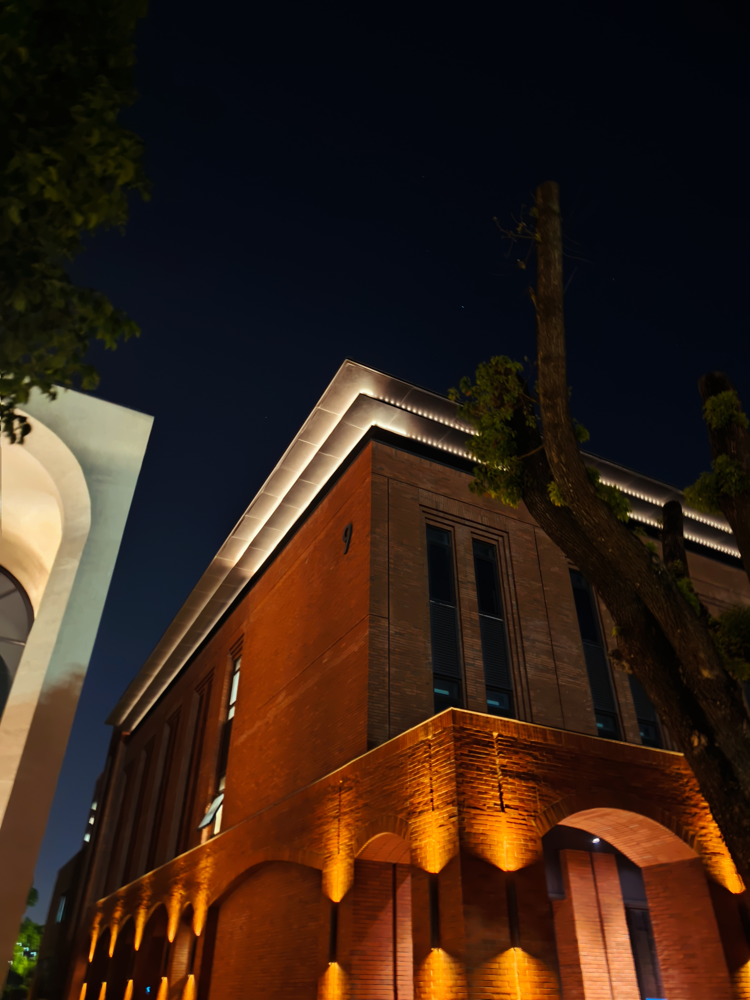

## 来学校之前

老师一通电话打过来，让我进行26级的暑期科研培训，在交流中提到其余的几个同门都已经线下进组了，除了一位在上海实习的来不了，我竟然成了最晚的一位，在慌乱中，我提前承诺了老师马上线下进组，当时想着也没什么，只是过来学习提升自己。过了几天，我甚至还和朋友去了张家界游玩，一点也没把提前进组当回事，一起晚上看世界杯，一起晚上聊到早上六点。从张家界回来之后，基本就要立马出发去宁波了，我却在这个时候莫明陷入了某种焦虑。

心情就莫名的很压抑，担心不适应新的地方，要注意和老师的沟通，要和太多太多的陌生人重新社交，这一切的一切都让我越想越焦虑。
我也不知道为什么会这样，但是就是一直止不住的会这么想。总是担心这个，担心那个。害怕无法适应，害怕住的不舒服，害怕让别人失望。每一次都是临近才爆发，真的很讨厌这样。
我还记得大一转完专业，大二进到新的宿舍的时候也是这样。明明一直都没什么反应，但是第1天入住新的宿舍的时候，突然就会情绪崩溃，觉得新舍友很不正常，新环境很难适应，很怀念大一的舍友。甚至还发了一个朋友圈，虽然第2天就删了。但其实现在想来，舍友也并没有为难我，只是我自己突然情绪崩溃了。

不过情绪来的快去的也快，可能这也算是我的一个优点。不过倒霉的是飞机预定的航班恰巧遇到了台风巴威，被迫改签到了第二天的下午，这样我就只能在宁波定一晚上的酒店了，太抽象了。

下面附一张去张家界旅游的照片，嘻嘻。

## 来到宁波第一天

从滴滴的车下来之后，我拖着行李和我的5070显卡，最直观的不是古典宏大的校园，而是暴晒的太阳，汗一直都没有停过，我又不熟悉校园，一直在走错路。由于是线上申请，负责办理入住的行政老师和我的导师都没有和我说我被安排在哪一栋宿舍楼，导致我压根就不知道要去哪里找我的宿舍，这真的非常折磨，尤其是这么晒的天气。乱逛中我误打误撞来到了浙软的饭堂，一瞬间我就从地狱来到了天堂，这里实在是太凉快了，我在饭堂休息了快一个钟，顺便吃了个饭。

饭后，我继续寻找，在同门的帮助下我终于找到了宿舍。但是，我进不去，要人脸识别。非常无奈，我只能在旁边等，等别的同学进去我才能尾随进去，太抽象了，梦回本科时校卡丢了只能跟着别人进宿舍。还好最终还是靠这个办法进来了，宿舍的阿姨非常好，帮助我解决了一系列要入住的事项，在办理好入住后，我终于可以放下我的行李了。

很难受的一点就是，我的宿舍在最高层，而且宿舍楼竟然没有电梯可以坐，我只能一层一层爬。如果身上啥也没有也就算了，关键是我还寄过来了我的电脑主机，被子枕头，甚至还有新买的显示器。这些我都需要一个一个亲手搬回宿舍，我已经不想再回想那天有多累了，太曲折了。

## 进入实验室之后

来到学校的第一天一直在忙着办理入住和购置生活用品，收拾宿舍等等，搞完已经到晚上了。所以我正式进去实验室是来到学校的第二天，早上九点半，我进入了实验室的大门。实验室的师兄师姐都挺热情的，和我同级的几位研0也很好，带着我认识实验室的师兄师姐，非常感谢他们。中午，我和实验室的其他人一起去吃饭，兜兜转转竟然走了快半个钟，由于是暑假，去隔壁学校宁理的门关了，导致我们一行人只能绕路。吃饭时和实验室的人一起聊天，打探到了不少消息，师兄们都挺随和的。第一天一直工作到了晚上快九点，说是工作，感觉也挺摸鱼的，可能是老师不在，codex工作时，我就摸鱼，刷刷手机时间就过去了。

要走的时候被他们拉过去打乒乓球，打得我满头大汗，一直在捡球，我都没打过乒乓球，这实在是太为难我了，不过我也确实要运动一下，感觉身体素质确实有待提高。一天结束后，我走在回宿舍的路上回想着这一天，感觉提前进组也没什么可焦虑的，可能我就是改不了临阵焦虑的习惯吧，不过我挺高兴能结识这些优秀的同门，一起进步。

下面附一张回宿舍时拍的照片，不得不说，夜晚的学校比白天时好看太多了。

## 总结

很多人说提前进组就是提前延毕，可能确实是这样的，但是我们也不能总从悲观的角度去看问题，提前适应学校的环境，提前和实验室的同门交流这些也是进组的好处。从去年925保研结束之后，我就一直处于比较松散的状态，熬夜，暴饮暴食，放纵自己。我其实有想过改变，但是总是下不去决心，来学校的这几天，也强制让我改掉了这些坏毛病，这可能也算是其中一个好处，毕竟实验室早上打卡9点半，没招了。总而言之，Stay curious, stay moving！已经来到这了，就接着往下走吧！
