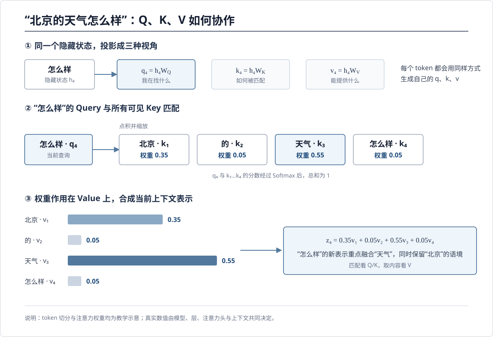
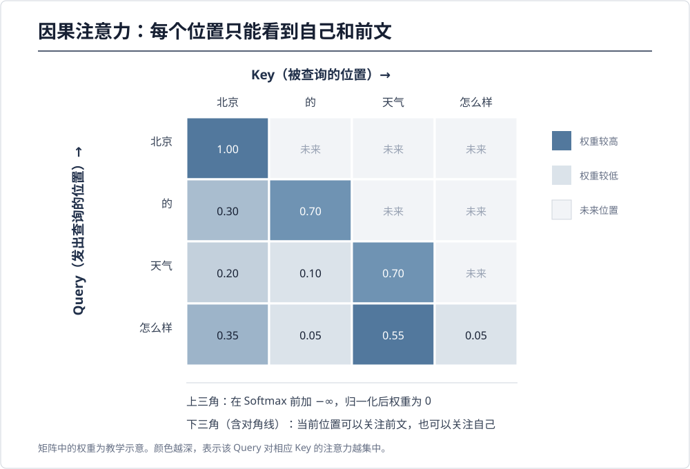

## 写作提纲

阅读《大模型导论》过程中，对大语言模型基础结构的理解与整理。

本文主要围绕几个问题展开：

-   文本如何进入大模型？
-   Embedding 和 Encoder 是不是同一个过程？
-   为什么现在主流模型都是 Decoder-only？
-   Attention 中 Q、K、V 如何产生？
-   Decoder 如何一步步生成回答？
-   logits 和 Softmax 分别是什么？
-   大模型为什么不会永远选择最高概率 token？

------------------------------------------------------------------------

# 正文

# 1. Token Embedding 与位置编码

## 1.1 问题：Embedding 是什么？为什么需要它？

计算机无法直接理解文本。

例如：

    我喜欢苹果

经过 tokenizer 后，会转换为 token：

    [1543, 927, 6842]

但是 token ID 本身没有任何语义。

例如：

    6842

这个数字并不代表"苹果"的含义，只是词表中的编号。

因此需要 Embedding：

$$ \boldsymbol{\text{token ID} \rightarrow \text{embedding vector}} $$

Embedding 会把每个 token 映射到一个高维向量空间。

例如：

    苹果
    ↓
    [0.23, -0.15, 0.76, ...]

这个向量就是模型后续计算的输入。

------------------------------------------------------------------------

## 1.2 为什么高维向量可以表示语义？

问题：

> 为什么简单的数字向量可以表达"猫"和"狗"接近，"国王"和"女王"存在关系？

关键在于：

模型不是人工规定这些语义，而是在大量文本训练中学习得到的。

语言中经常一起出现的词，会逐渐形成相似的向量表示。

例如：

    我养了一只猫

    我养了一只狗

猫和狗出现在类似环境中，因此向量空间中的距离会比较接近。

而：

    猫
    银行

出现环境差异很大，因此距离通常较远。

这体现了一个思想：

> 一个词的含义，可以通过它经常和哪些词共同出现来学习。

------------------------------------------------------------------------

## 1.3 词向量中的语义关系

经典词向量中存在一些有趣现象：

$$ \boldsymbol{\text{国王}-\text{男人}+\text{女人} \approx \text{女王}} $$

直观理解：

    男人 → 女人

    国王 → 女王

向量空间中可能存在类似的关系方向。

但是需要注意：

这不是说某一个维度代表"性别"，另一个维度代表"王权"。

真实情况是：

> 语义信息通常分布在多个维度中。

------------------------------------------------------------------------

# 2. 位置编码（Position Encoding）

## 2.1 问题：为什么 Embedding 后还需要位置编码？

Transformer 没有循环结构。

它同时处理整个序列，因此天然不知道：

    狗咬人

和：

    人咬狗

的区别。

两个句子包含相同的词，但是顺序不同，含义完全不同。

因此需要告诉模型：

> 每个 token 在句子中的位置。

传统 Transformer：

$$ \boldsymbol{h_i=e_i+p_i} $$

其中：

-   $e_i$：token embedding
-   $p_i$：位置编码

------------------------------------------------------------------------

## 2.2 现代大模型的位置编码

现代 Decoder-only 模型，例如 GPT 类模型，通常使用 RoPE。

它不是简单把位置向量直接相加，而是在注意力计算过程中加入位置信息。

因此：

    Embedding：
    这个词是什么

    位置编码：
    这个词在哪里

两者解决的是不同问题。

------------------------------------------------------------------------

# 3. Embedding 和 Encoder 是一回事吗？

## 问题：

> Embedding 不也是把文本转成模型能理解的形式吗？和 Encoder
> 做的是不是同一件事？

答案：

不是。

二者作用层次不同。

------------------------------------------------------------------------

## 3.1 Embedding

Embedding 更像查字典。

它完成：

    token ID
    ↓
    基础向量

例如：

    苹果
    ↓
    一个固定向量

但是它不知道上下文。

------------------------------------------------------------------------

## 3.2 Encoder

Encoder 负责进一步理解上下文。

例如：

    苹果发布了新手机

这里的苹果是公司。

而：

    我吃了一个苹果

这里的苹果是水果。

初始 Embedding 可能一样。

但是经过 Encoder：

    苹果 + 发布 + 手机

会形成科技公司的语义。

    苹果 + 吃 + 一个

会形成水果语义。

因此：

> Embedding 提供词的初始表示，Encoder 根据上下文生成真正的语义表示。

------------------------------------------------------------------------

# 4. 为什么现在主流模型都是 Decoder-only？

## 问题：

> 去掉 Encoder 后，模型怎么理解输入？

传统 Transformer：

    Encoder
       ↓
    Decoder

Encoder 负责理解输入。

Decoder 根据 Encoder 输出生成答案。

但是 GPT 类模型采用：

    Decoder-only

也就是没有独立 Encoder。

------------------------------------------------------------------------

## Decoder-only 的流程

    文本
    ↓
    Tokenizer
    ↓
    Token Embedding
    ↓
    位置编码
    ↓
    Decoder Transformer
    ↓
    Logits
    ↓
    Softmax
    ↓
    生成 token

注意：

Decoder-only 去掉的是 Transformer Encoder 模块。

不是去掉：

-   Embedding
-   上下文理解能力

Decoder 自己通过 Self-Attention 学习上下文。

------------------------------------------------------------------------

# 5. Attention 中 Q、K、V 从哪里来？

前面说到，Attention 会让一个词有选择地参考上下文。这里自然会追问两个问题：**Q、K、V 分别负责什么，它们又是怎样计算出来的？**

先不急着看矩阵，我们用“北京的天气怎么样”走一遍完整过程。为便于说明，下面暂把它写成“北京 / 的 / 天气 / 怎么样”四个 token；真实模型怎样切分，取决于 tokenizer。

## 5.1 把注意力理解成一次“带权检索”

当模型处理“怎么样”时，可以把它想象成在问：**前面的哪些词和我最相关？** Query、Key、Value 正好对应检索里的三个角色：

| 向量 | 直观含义 | 在这个例子中 |
|---|---|---|
| Query（查询） | 当前 token 发出的“搜索请求”：我在找什么？ | “怎么样”的 Query 在寻找要被询问的对象 |
| Key（键） | 每个 token 用来参与匹配的“索引特征” | “北京”“的”“天气”等 token 都提供自己的 Key |
| Value（值） | 匹配成功后真正被取出的语义信息 | “天气”的 Value 携带它在当前上下文中的内容 |

这个类比有助于理解分工，但要注意：**Key 不是人手写的“地点”“气象”等文字标签**，而是模型从隐藏状态中学出的数值向量。Query 和 Key 决定“应该看谁”，Value 决定“从它那里取走什么信息”。

## 5.2 三类向量都来自当前隐藏状态

假设第 $i$ 个 token 进入某一层 Attention 时的隐藏状态为 $h_i$。同一个 $h_i$ 分别经过三次不同的线性投影，就得到：

$$ q_i=h_iW_Q,\qquad k_i=h_iW_K,\qquad v_i=h_iW_V $$

把整句话所有 token 的隐藏状态堆成矩阵 $H$，就是更常见的写法：

$$ Q=HW_Q,\qquad K=HW_K,\qquad V=HW_V $$

$W_Q$、$W_K$、$W_V$ 都是模型参数。它们通常在训练开始时随机初始化，再根据语言建模损失通过反向传播不断更新。训练完成后，三组投影逐渐形成不同分工：

- $W_Q$ 把隐藏状态投影成“这一位置想找什么”；
- $W_K$ 把隐藏状态投影成“这一位置适合被怎样匹配”；
- $W_V$ 把隐藏状态投影成“这一位置可以提供什么内容”。

因此，Q、K、V 不是从外部凭空准备好的三份数据，而是**同一批上下文表示经过三组可学习参数得到的三种视角**。

## 5.3 从匹配分数到上下文表示

现在看“怎么样”这个位置。它先用自己的 Query $q_4$ 与每个可见 token 的 Key 做点积，并除以 $\sqrt{d_k}$ 缩放：

$$ s_{4j}=\frac{q_4k_j^T}{\sqrt{d_k}} $$

点积可以理解为匹配度打分：两个向量在相关方向上越一致，分数越大。除以 $\sqrt{d_k}$ 是为了避免向量维度较大时点积过大，使 Softmax 过早饱和。

接着用 Softmax 把这些分数归一化成总和为 1 的注意力权重：

$$ \alpha_{4j}=\operatorname{softmax}(s_{4j}) $$

为了直观说明，假设“怎么样”得到下面这组权重（数字仅为示意，并非真实模型计算结果）：

| 被关注的 token | 北京 | 的 | 天气 | 怎么样 |
|---|---:|---:|---:|---:|
| 注意力权重 | 0.35 | 0.05 | 0.55 | 0.05 |

最后，模型用权重对所有 Value 加权求和：

$$ z_4=0.35v_{\text{北京}}+0.05v_{\text{的}}+0.55v_{\text{天气}}+0.05v_{\text{怎么样}} $$

“天气”的权重最高，因此它提供的信息最多；“北京”也贡献了地点语境；“的”贡献较少。这样得到的 $z_4$ 不再只是“怎么样”自身的表示，而是融合了与当前问题最相关的上下文。

把所有位置一次性写成矩阵，就是 Attention 的完整公式：

$$ \operatorname{Attention}(Q,K,V)=\operatorname{softmax}\left(\frac{QK^T}{\sqrt{d_k}}\right)V $$

可以把它记成三步：**Query 与 Key 打分 → Softmax 变成权重 → 按权重汇总 Value。**

## 5.4 为什么注意力图通常是下三角形？

在 GPT 这类自回归模型中，生成当前位置时不能偷看未来 token。因此，第 $i$ 个位置只能关注自己和它前面的内容。

实现上会在 Softmax 之前加一个因果掩码 $M$：

$$ \operatorname{softmax}\left(\frac{QK^T}{\sqrt{d_k}}+M\right) $$

$$ M_{ij}=0\quad (j\le i),\qquad M_{ij}=-\infty\quad (j>i) $$

未来位置的分数被设为 $-\infty$，经过 Softmax 后权重就变成 0。这就是注意力热力图中上三角通常为空的原因。对“怎么样”而言，四个 token 都已经出现，所以它可以参考“北京”“的”“天气”以及自己。

## 5.5 多头注意力是在学习多种“相关”

上面的过程描述的是一个注意力头。实际 Transformer 会并行使用多个头，每个头都有自己的一组投影视角，可能分别偏向实体关系、语法依赖、位置关系等不同模式。各头的结果拼接后再做一次线性变换，使模型能同时整合多种相关性。

> 一句话总结：Q、K、V 都由 token 的隐藏状态通过可学习投影得到；Q 和 K 负责确定关注权重，V 负责提供被汇总的信息。

------------------------------------------------------------------------

# 6. Self-Attention 和 Cross-Attention

## 问题：

> Decoder 中 Cross-Attention 和多头自注意力有什么区别？

二者都属于 Attention。

区别在于 Q、K、V 来源不同。

------------------------------------------------------------------------

## Self-Attention

Q、K、V 来自同一个序列。

作用：

> 理解当前序列内部关系。

例如：

    我 喜欢 猫

"喜欢"可以关注"我"和"猫"。

------------------------------------------------------------------------

## Cross-Attention

来源：

    Q：Decoder

    K、V：Encoder

作用：

> Decoder 查询 Encoder 提供的信息。

例如机器翻译：

    英文输入
    ↓
    Encoder
    ↓
    Decoder Cross-Attention
    ↓
    中文输出

可以理解为：

Self-Attention：

> 自己理解自己。

Cross-Attention：

> Decoder 查询另一份信息。

------------------------------------------------------------------------

# 7. Decoder 如何生成回答？

## 问题：

> Decoder 最后的输出是什么？

最后 Decoder 输出隐藏状态：

$$ \boldsymbol{h} $$

但是：

$$ \boldsymbol{h} $$

不是文字。

需要经过输出层：

$$ \boldsymbol{logits=hW_{vocab}+b} $$

------------------------------------------------------------------------

# 8. logits 和 Softmax

## logits 是什么？

logits 是模型对每个候选 token 的原始分数。

例如词表：

    猫
    狗
    苹果

模型输出：

    猫：3.2
    狗：1.1
    苹果：0.7

这不是概率。

------------------------------------------------------------------------

## Softmax 做什么？

Softmax 输入：

    logits

输出：

    概率分布

例如：

    猫：0.8
    狗：0.1
    苹果：0.1

满足：

$$ \boldsymbol{\sum_i p_i=1} $$

然后模型根据概率选择下一个 token。

------------------------------------------------------------------------

# 9. 为什么不是永远选择最高概率？

## Argmax

最简单方法：

$$ \boldsymbol{x=\arg\max P(x)} $$

永远选择概率最高 token。

优点：

-   稳定

缺点：

-   缺少创造性

------------------------------------------------------------------------

# 10. Temperature、Top-k、Top-p

## Temperature

调整概率分布平滑程度。

低温：

    更确定

高温：

    更多样

------------------------------------------------------------------------

## Top-k

只保留概率最高的 k 个 token。

例如：

    猫 0.8
    狗 0.1
    苹果 0.05
    汽车 0.05

top-k=2：

只考虑：

    猫
    狗

------------------------------------------------------------------------

## Top-p

根据累计概率选择候选。

例如：

top-p=0.9：

    猫 0.8
    狗 0.1
    苹果 0.05

累计：

    猫+狗=0.9

因此保留前两个。

现代大模型通常结合：

    Temperature + Top-p

在稳定和创造之间取得平衡。

------------------------------------------------------------------------

# 总结

一个大语言模型生成文本的完整过程：

    文本
    ↓
    Tokenizer
    ↓
    Token Embedding
    ↓
    位置编码
    ↓
    Transformer Decoder
    ↓
    隐藏状态
    ↓
    Linear 输出层
    ↓
    Logits
    ↓
    Softmax
    ↓
    概率分布
    ↓
    选择 token

理解这些基础结构，是继续学习预训练、SFT、RLHF、RAG 和 Agent 的基础。
